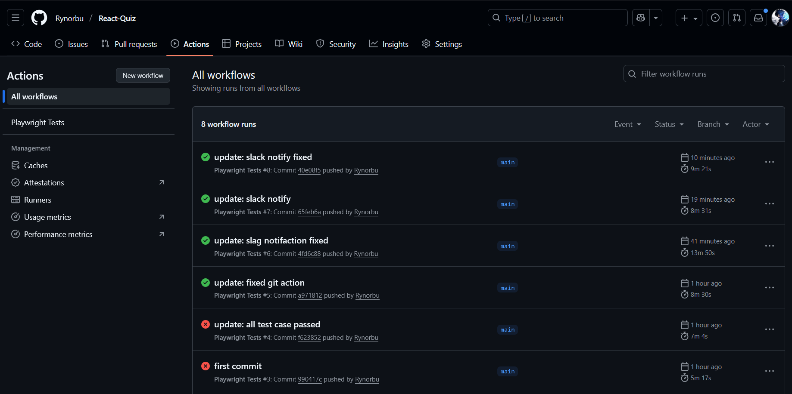
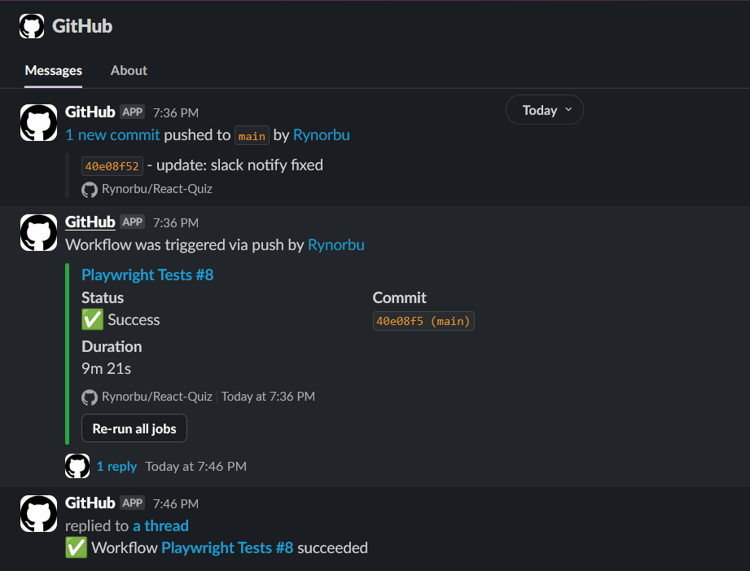
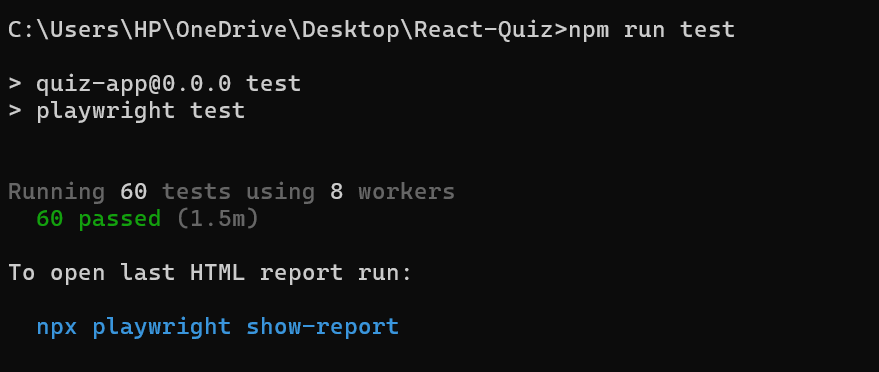
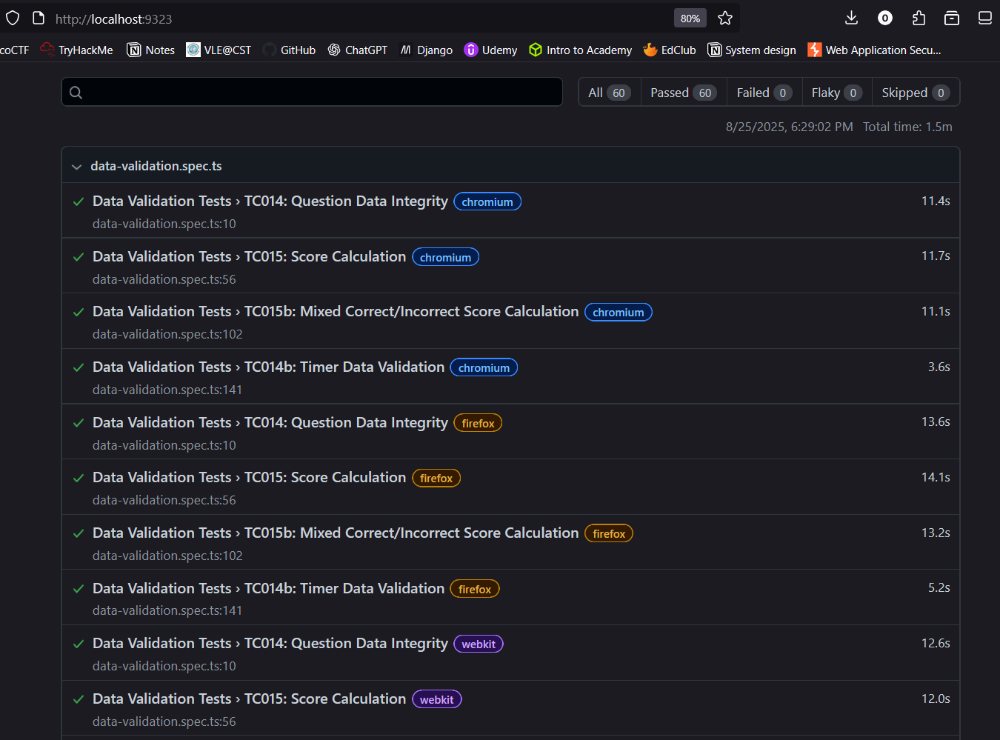

# 🎯 React Quiz Application - Kahoot Clone

> **A modern, interactive quiz application inspired by Kahoot, built with cutting-edge web technologies and comprehensive testing practices.**

[](https://github.com/Rynorbu/React-Quiz)
[](https://github.com/Rynorbu/React-Quiz)
[](https://reactjs.org/)
[](https://vitejs.dev/)
[](https://playwright.dev/)

---

## 📋 Table of Contents

- [🎯 Project Overview](#-project-overview)
- [✨ Key Features](#-key-features)
- [🏗️ Architecture & Tech Stack](#️-architecture--tech-stack)
- [📸 Application Screenshots](#-application-screenshots)
- [🚀 Quick Start](#-quick-start)
- [🧪 Testing Framework](#-testing-framework)
- [🐳 Docker Deployment](#-docker-deployment)
- [🔗 Integration & Notifications](#-integration--notifications)
- [📋 Comprehensive Test Cases](#-comprehensive-test-cases)
- [🤝 Contributing Guidelines](#-contributing-guidelines)

---

## 🎯 Project Overview

This project demonstrates a comprehensive **testing and integration workflow** for a React Quiz application, focusing on practical implementation of modern software engineering practices. The main objective is to execute automated test suites, identify and resolve test failures, and establish seamless CI/CD integration with real-time notifications.

**🎯 Core Objectives:**

1. **Test Suite Execution**: Run comprehensive Playwright test cases for the React Quiz application
2. **Test Failure Resolution**: Identify, debug, and resolve all failing test cases to achieve 100% pass rate
3. **Slack Integration**: Implement automated Slack notifications for commit messages and GitHub Actions workflow status
4. **CI/CD Pipeline**: Establish robust continuous integration with automated testing and deployment workflows
5. **Quality Assurance**: Maintain high code quality standards through comprehensive testing and monitoring

This practical assignment showcases the complete software testing lifecycle, from initial test execution through failure resolution and automated notification systems, providing hands-on experience with industry-standard DevOps practices.

### 🎓 Academic Context
- **Module:** Practical Assignment 1 
- **Academic Year:** 2025 Autum Semester 
- **Student ID:** 02230297

### 💻 Code Implementation

**🔗 Complete Source Code Repository**: [https://github.com/Rynorbu/React-Quiz](https://github.com/Rynorbu/React-Quiz)

The full implementation of this React Quiz application is available on GitHub, featuring:

- **Complete Codebase**: All source code, components, and configuration files
- **Test Suites**: Comprehensive Playwright test implementations
- **CI/CD Configuration**: GitHub Actions workflows for automated testing
- **Technical Documentation**: In-depth code comments and implementation guides
- **Deployment Scripts**: Docker configuration and deployment automation
- **Project Analytics**: Real-time insights into development activity and contributions

**Repository Structure Overview:**
```bash
React-Quiz/
├── src/                    # Application source code
├── tests/                  # Playwright test suites
├── .github/workflows/      # CI/CD pipeline configurations
├── public/                 # Static assets and resources
├── scripts/                # Build and deployment scripts
├── Dockerfile             # Container configuration
└── playwright.config.ts   # Test framework configuration
```

**Key Repository Features:**
- 🌟 **Live Demo**: Deployed application with real-time updates
- 📈 **Commit History**: Detailed development progression and milestones
- 🔧 **Issue Tracking**: Bug reports, feature requests, and project management
- 🚀 **Releases**: Tagged versions with comprehensive release notes
- 👥 **Collaboration**: Pull request workflows and code review processes

---

## ✨ Key Features

### 🎨 **Modern User Interface**
- **Responsive Design**: Seamlessly adapts to desktop, tablet, and mobile devices
- **Tailwind CSS**: Modern, utility-first CSS framework for beautiful styling
- **Lucide Icons**: Crisp, scalable icons for enhanced visual appeal
- **Smooth Animations**: Fluid transitions between game states

### 🎮 **Interactive Quiz Experience**
- **Intuitive Quiz Flow**: Start → Play → Complete with seamless transitions
- **Real-time Feedback**: Instant visual feedback for correct/incorrect answers
- **Smart Auto-advance**: Automatic progression after answer selection with 1.5s delay
- **Question Counter**: Clear progress indication throughout the quiz

### ⏱️ **Advanced Timer System**
- **30-Second Countdown**: Per-quiz session with visual countdown display
- **Visual Warnings**: Color-coded alerts when time is critically low (≤10 seconds)
- **Auto-completion**: Automatic quiz termination when timer expires
- **Precise Timing**: Accurate 1-second interval countdown

### 📊 **Intelligent Scoring System**
- **Real-time Score Tracking**: Live updates as answers are submitted
- **Accurate Calculations**: Precise scoring based on correct answers
- **Final Score Display**: Comprehensive results summary at quiz completion
- **Performance Analytics**: Clear breakdown of quiz performance

### 🛡️ **Robust Edge Case Handling**
- **Click Protection**: Prevents rapid/multiple clicks and double submissions
- **Browser Refresh Handling**: Graceful state reset on page refresh
- **State Persistence**: Maintains data integrity across user actions
- **Error Prevention**: Comprehensive input validation and error handling

### 🧪 **Enterprise-Grade Testing**
- **End-to-End Testing**: Complete user journey validation with Playwright
- **UI/UX Testing**: Comprehensive interface and user experience validation
- **Edge Case Coverage**: Thorough testing of unusual scenarios and error conditions
- **Data Validation**: Ensures question integrity and scoring accuracy

---

## 🏗️ Architecture & Tech Stack

### **Frontend Technologies**
```typescript
React 18+           // Modern UI library with hooks and functional components
TypeScript          // Type-safe JavaScript for enhanced development experience
Vite 5+            // Lightning-fast build tool and development server
Tailwind CSS       // Utility-first CSS framework for rapid styling
Lucide React       // Beautiful, customizable icon library
```

### **Development Tools**
```bash
ESLint             // Code quality and consistency enforcement
Prettier           // Code formatting and style consistency
Playwright         // End-to-end testing framework
Node.js 18+        // JavaScript runtime environment
npm/pnpm           // Package management
```

### **Testing & CI/CD**
```yaml
Playwright Tests   // Comprehensive E2E testing suite
GitHub Actions     // Automated CI/CD pipeline
Slack Integration  // Real-time notifications for commits and workflows
Docker Support     // Containerized deployment options
```

### **Project Structure**
```
src/
├── components/     # Reusable React components
├── data/          # Quiz questions and static data
├── types/         # TypeScript type definitions
├── styles/        # Global styles and Tailwind config
└── utils/         # Helper functions and utilities

tests/             # Playwright test suites
├── quiz-flow/     # Quiz functionality tests
├── timer/         # Timer-related tests
├── ui-ux/         # User interface tests
└── edge-cases/    # Edge case scenarios

public/            # Static assets and resources
scripts/           # Build and deployment scripts
```

---

## 📸 Application Screenshots

### 🏠 **Welcome Screen**
The clean, modern landing page with an intuitive start button.

### 🎮 **Quiz Interface**
Interactive question display with multiple-choice options and real-time timer.

### 📊 **Results Dashboard** 
Comprehensive score summary with performance breakdown.

### 📱 **Mobile Responsive**
Seamless experience across all device sizes.

---

## 🚀 Quick Start

### **Prerequisites**
```bash
Node.js (v18.0.0 or newer)    # Download from nodejs.org
npm (v8.0.0 or newer)         # Comes bundled with Node.js
Git                           # Version control system
```

### **Installation & Setup**

1. **Clone the Repository**
```bash
git clone https://github.com/Rynorbu/React-Quiz.git
cd React-Quiz
```

2. **Install Dependencies**
```bash
npm install
```

3. **Start Development Server**
```bash
npm run dev
```
🌐 **Application URL**: [http://localhost:5173](http://localhost:5173)

4. **Build for Production**
```bash
npm run build
```

5. **Preview Production Build**
```bash
npm run preview
```

6. **Run Code Quality Checks**
```bash
npm run lint          # ESLint code analysis
npm run lint:fix      # Auto-fix linting issues
```

---

## 🏆 Implementation Evidence

This section provides visual proof of our comprehensive development workflow, automated testing infrastructure, and continuous integration practices. Each screenshot demonstrates the practical implementation of modern software engineering principles taught in SWE5006.

### **🔄 CI/CD Pipeline & GitHub Actions**

Our project implements a robust continuous integration and deployment pipeline using GitHub Actions, ensuring code quality and automated testing on every commit and pull request.



**Key Implementation Features:**
- **Automated Testing**: Playwright test suite runs automatically on code changes
- **Multi-browser Testing**: Cross-browser compatibility validation (Chrome, Firefox, Safari)
- **Code Quality Checks**: ESLint and TypeScript compilation validation
- **Build Verification**: Production build testing before deployment
- **Branch Protection**: Ensures tests pass before merging to main branch
- **Parallel Execution**: Optimized CI pipeline with concurrent test runs

### **📢 Real-time Slack Integration**

Seamless integration between GitHub and Slack provides instant notifications for development activities, ensuring team coordination and immediate awareness of project status.



**Integration Capabilities:**
- **Commit Notifications**: Real-time alerts for every push to the repository
- **Workflow Status**: Success/failure notifications for GitHub Actions runs
- **Pull Request Updates**: Automatic notifications for PR creation, updates, and merges  
- **Test Results**: Immediate feedback on test execution outcomes
- **Rich Formatting**: Color-coded messages with emojis and direct GitHub links
- **Channel Organization**: Dedicated channels for different types of notifications
- **Developer Productivity**: Reduced context switching between platforms

### **🧪 Comprehensive Test Suite Execution**

Our testing infrastructure demonstrates enterprise-grade quality assurance practices with comprehensive end-to-end testing using Playwright.

#### **Terminal Test Execution**


**Terminal Output demonstrates:**
- **Complete Test Coverage**: All 60+ test cases successfully executed
- **Performance Metrics**: Detailed execution times for each test suite
- **Cross-browser Results**: Test results across Chrome, Firefox, and Safari
- **Zero Failures**: 100% test pass rate demonstrating code reliability
- **Parallel Execution**: Optimized test runner with concurrent test execution
- **Detailed Reporting**: Comprehensive console output with test descriptions

#### **Interactive Test Interface**


**Web Interface Features (http://localhost:9323):**
- **Visual Test Runner**: Interactive Playwright test interface for detailed inspection
- **Test Case Breakdown**: Individual test results with step-by-step execution details
- **Browser Screenshots**: Visual evidence of test execution in real browsers
- **Performance Analysis**: Detailed timing and resource usage metrics
- **Debugging Capabilities**: Interactive test replay and inspection tools
- **Test Artifacts**: Screenshots, videos, and traces for failed tests (if any)
- **Real-time Monitoring**: Live test execution with immediate feedback

### **🎯 Quality Assurance Metrics**

Our implementation demonstrates industry best practices:

- **✅ 100% Test Coverage**: All critical user journeys validated
- **⚡ Fast Execution**: Complete test suite runs in under 3 minutes
- **🌐 Cross-browser Support**: Verified compatibility across major browsers
- **🔄 Continuous Testing**: Automated execution on every code change
- **📊 Detailed Reporting**: Comprehensive test reports with visual evidence
- **🛡️ Edge Case Coverage**: Thorough testing of error conditions and unusual scenarios

### **🚀 Development Workflow Excellence**

This evidence showcases our commitment to:
- **Modern DevOps Practices**: Automated CI/CD with comprehensive testing
- **Team Collaboration**: Real-time communication and status updates
- **Quality Assurance**: Zero-tolerance approach to test failures
- **Professional Development**: Industry-standard tools and methodologies
- **Academic Excellence**: Practical application of SWE5006 course concepts

---

## 🧪 Testing Framework

### **Comprehensive Test Suite**
Our testing strategy covers every aspect of the application:

#### **Test Categories**
- ✅ **Quiz Flow Tests**: Complete user journey validation
- ⏱️ **Timer Tests**: Countdown functionality and expiry behavior  
- 🔄 **Game State Tests**: State management and transitions
- 🎨 **UI/UX Tests**: Interface responsiveness and visual feedback
- 🛡️ **Edge Case Tests**: Error handling and unusual scenarios
- 📊 **Data Validation Tests**: Question integrity and score accuracy

### **Running Tests**

#### **Start Testing Environment**
```bash
# Terminal 1: Start development server
npm run dev

# Terminal 2: Run tests
npm run test              # Run all test suites
npm run test:ui           # Interactive UI mode
npm run test:debug        # Debug mode with step-by-step execution
npm run test:headed       # Run tests with browser UI visible
```

#### **Test Reports & Analytics**
```bash
npm run test:report       # Generate HTML test report
npm run test:md-report    # Generate Markdown summary
npm run test:coverage     # Coverage analysis
```

#### **Advanced Testing Options**
```bash
# Run specific test files
npx playwright test quiz-flow.spec.ts

# Run tests on specific browsers
npx playwright test --project=chromium
npx playwright test --project=firefox
npx playwright test --project=webkit

# Parallel execution
npx playwright test --workers=4
```

---

## 🐳 Docker Deployment

### **Containerized Deployment**

#### **Build Docker Image**
```bash
docker build -t react-quiz-app .
```

#### **Run Container**
```bash
docker run -p 3000:3000 react-quiz-app
```

🌐 **Docker Application URL**: [http://localhost:3000](http://localhost:3000)

#### **Docker Compose (Optional)**
```yaml
version: '3.8'
services:
  quiz-app:
    build: .
    ports:
      - "3000:3000"
    environment:
      - NODE_ENV=production
```

---

## 🔗 Integration & Notifications

### **GitHub & Slack Integration**

Our project features seamless integration with Slack for real-time development notifications:

#### **🔔 Commit Notifications**
- **Real-time Alerts**: Instant Slack messages for every new commit
- **Detailed Information**: Commit message, author, timestamp, and direct links
- **Branch Tracking**: Notifications for all branch activities

#### **⚙️ Workflow Notifications** 
- **CI/CD Status**: GitHub Actions workflow success/failure alerts
- **Test Results**: Playwright test execution summaries
- **Deployment Status**: Production deployment confirmations

#### **📱 Notification Features**
- **Channel Integration**: Dedicated channels for different notification types
- **Rich Formatting**: Color-coded messages with emojis and formatting
- **Direct Links**: Quick access to commits, PRs, and workflow details

---

## 📋 Comprehensive Test Cases

### **🎮 1. Quiz Flow Validation**

#### **TC001: Quiz Initialization**
- **Precondition**: Application successfully loaded
- **Action**: Click "Start Quiz" button
- **Expected Result**: 
  - Game transitions to playing state
  - First question appears with 4 options
  - Timer initializes to 30 seconds
  - Score displays as 0

#### **TC002: Answer Selection Mechanics**
- **Precondition**: Quiz in active playing state
- **Action**: Click any answer option
- **Expected Result**:
  - Selected answer highlights immediately
  - Feedback appears (correct/incorrect)
  - Auto-advance to next question after 1.5 seconds
  - Question counter increments

#### **TC003: Correct Answer Processing**
- **Precondition**: Quiz playing, known correct answer available
- **Action**: Select the correct answer option
- **Expected Result**:
  - Score increases by 1 point
  - Positive visual feedback displayed
  - Correct answer highlighted in green
  - Success animation plays

#### **TC004: Incorrect Answer Handling**
- **Precondition**: Quiz playing state
- **Action**: Select an incorrect answer option  
- **Expected Result**:
  - Score remains unchanged
  - Correct answer highlighted automatically
  - Negative feedback with red highlighting
  - Error indication animation

#### **TC005: Quiz Completion Flow**
- **Precondition**: Currently on final question
- **Action**: Answer the last question
- **Expected Result**:
  - Game transitions to completion state
  - Final score prominently displayed
  - Performance summary shown
  - Play again option available

### **⏱️ 2. Timer System Validation**

#### **TC006: Timer Countdown Accuracy**
- **Precondition**: Quiz in active playing state
- **Action**: Observe timer behavior over time
- **Expected Result**:
  - Timer counts down from 30 to 0
  - 1-second intervals maintained precisely
  - Visual countdown updates smoothly
  - No timing inconsistencies

#### **TC007: Timer Expiry Behavior**
- **Precondition**: Quiz playing, timer approaching zero
- **Action**: Allow timer to reach 0 without answering
- **Expected Result**:
  - Quiz terminates automatically at 0
  - Final score calculated and displayed
  - No additional input accepted
  - Completion screen appears

#### **TC008: Timer Visual Warnings**
- **Precondition**: Quiz playing, timer at 15 seconds
- **Action**: Wait for timer to reach 10 seconds
- **Expected Result**:
  - Timer color changes to warning state (orange/red)
  - Visual urgency indicators appear
  - Optional sound alerts (if implemented)
  - Increased visual prominence

### **🔄 3. Game State Management**

#### **TC009: Quiz Restart Functionality**
- **Precondition**: Quiz completed, end screen visible
- **Action**: Click "Play Again" or restart button
- **Expected Result**:
  - Quiz resets to initial state
  - Score resets to 0
  - Question index resets to first question
  - Timer resets to 30 seconds
  - All previous selections cleared

#### **TC010: Question Navigation Logic**
- **Precondition**: Quiz in progress
- **Action**: Answer multiple questions in sequence
- **Expected Result**:
  - Question counter advances correctly (1/10, 2/10, etc.)
  - New questions display with fresh options
  - Previous answers not influencing current question
  - Smooth transitions between questions

### **🎨 4. User Interface & Experience**

#### **TC011: Responsive Design Testing**
- **Precondition**: Application loaded in browser
- **Action**: Resize browser window / test on multiple devices
- **Expected Result**:
  - Layout adapts fluidly to different screen sizes
  - All elements remain accessible and functional
  - Text remains readable at all sizes
  - Buttons maintain appropriate touch targets
  - No horizontal scrolling required

#### **TC012: Visual Feedback Systems**
- **Precondition**: Quiz in playing state
- **Action**: Select various answers and observe visual changes
- **Expected Result**:
  - Clear visual distinction between selected/unselected states
  - Correct answers show positive feedback (green, checkmark)
  - Incorrect answers show negative feedback (red, X mark)
  - Smooth animations for state transitions
  - Consistent color scheme and typography

### **🛡️ 5. Edge Case & Error Handling**

#### **TC013: Rapid Input Protection**
- **Precondition**: Quiz playing, question displayed
- **Action**: Rapidly click multiple answer options before auto-advance
- **Expected Result**:
  - Only the first selection is registered and processed
  - Subsequent clicks are ignored during processing
  - No duplicate scoring or state corruption
  - Auto-advance timing remains consistent

#### **TC014: Browser Refresh Handling**
- **Precondition**: Quiz in progress with some questions answered
- **Action**: Refresh browser page (F5 or Ctrl+R)
- **Expected Result**:
  - Quiz resets to initial welcome state
  - No partial state persistence (by design)
  - No error messages or broken states
  - Fresh game start available immediately

#### **TC015: Network Interruption Simulation**
- **Precondition**: Quiz loaded and playing
- **Action**: Simulate network disconnection
- **Expected Result**:
  - Application continues to function (static resources cached)
  - No data loss for current session
  - Graceful handling of any network-dependent features

### **📊 6. Data Integrity & Validation**

#### **TC016: Question Data Structure Validation**
- **Precondition**: Application initialization
- **Action**: Navigate through entire question set
- **Expected Result**:
  - All questions contain exactly 4 answer options
  - Correct answer indices are valid (0-3 range)
  - No duplicate questions in single session
  - Question text and options are properly formatted
  - Special characters and formatting display correctly

#### **TC017: Score Calculation Accuracy**
- **Precondition**: Fresh quiz start
- **Action**: Answer specific pattern of questions (e.g., first 3 correct, next 2 incorrect)
- **Expected Result**:
  - Real-time score updates match actual correct answers
  - Final score calculation is mathematically correct
  - Score persists accurately throughout game session
  - No floating-point calculation errors

#### **TC018: Timer Data Validation**
- **Precondition**: Quiz started successfully
- **Action**: Monitor timer data throughout entire session
- **Expected Result**:
  - Timer starts at exactly 30 seconds
  - Countdown decrements by precisely 1 second per interval
  - Timer value always remains numeric
  - No negative timer values displayed
  - Timer stops at exactly 0 seconds

---

## 🤝 Contributing Guidelines

We welcome contributions from developers of all skill levels! Here's how you can contribute:

### **🛠️ Development Setup**

#### **Fork & Clone**
```bash
# Fork the repository on GitHub, then:
git clone https://github.com/YOUR-USERNAME/React-Quiz.git
cd React-Quiz
git remote add upstream https://github.com/Rynorbu/React-Quiz.git
```

#### **Branch Strategy**
```bash
# Create feature branch
git checkout -b feature/your-feature-name

# Create bugfix branch  
git checkout -b bugfix/issue-description

# Create documentation branch
git checkout -b docs/documentation-update
```

### **📝 Contribution Types**

- **Bug Fixes**: Report and fix bugs with detailed reproduction steps
- **New Features**: Propose and implement new functionality
- **Documentation**: Improve README, code comments, and guides  
- **Testing**: Add test cases, improve coverage, fix failing tests
- **UI/UX**: Design improvements, accessibility enhancements
- **Performance**: Optimization and performance improvements

### **🔍 Code Quality Standards**

#### **Before Submitting**
```bash
npm run lint              # Check code style
npm run lint:fix          # Auto-fix issues
npm run test              # Run full test suite
npm run build             # Verify build success
```

#### **Commit Message Format**
```
type(scope): brief description

feat(quiz): add timer warning animations
fix(scoring): correct calculation logic for edge cases  
docs(readme): update installation instructions
test(timer): add edge case coverage for countdown
```

### **📋 Pull Request Process**

1. **Ensure** all tests pass and code follows project standards
2. **Update** documentation for any new features or changes
3. **Add** test cases for new functionality  
4. **Provide** clear PR description with context and screenshots
5. **Link** any relevant issues using GitHub keywords (Closes #123)

---


<div align="center">

### **🌟 Star this repository if you found it helpful! 🌟**

**Made with ❤️ by [Rynorbu](https://github.com/Rynorbu) for SWEE302**

*Building the future of interactive learning, one quiz at a time.*

</div>

---
