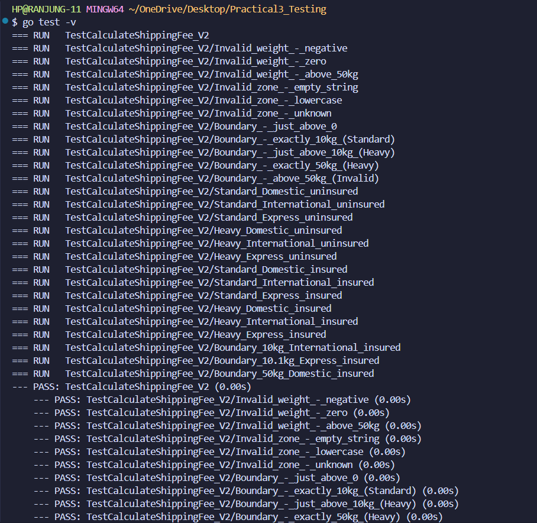
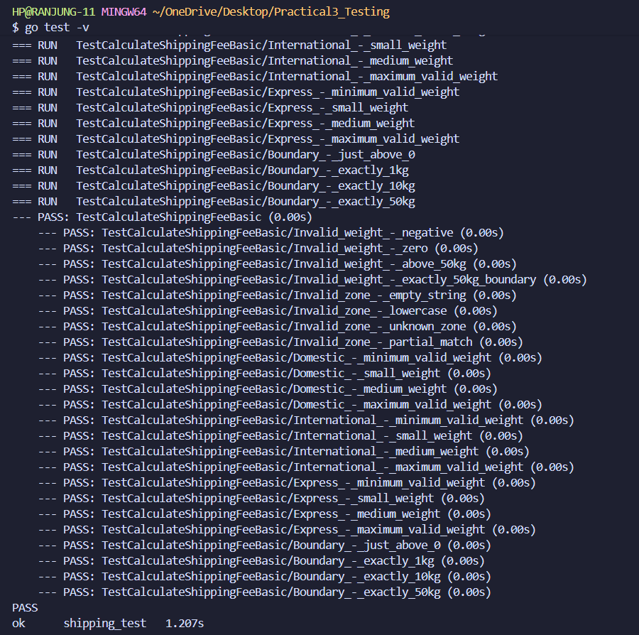
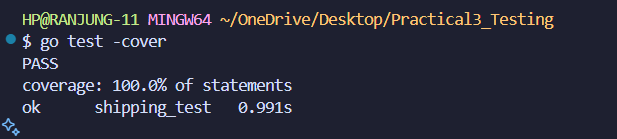

# Module Practical 3: Software Testing & Quality Assurance

## Advanced Shipping Fee Calculator - Test Analysis & Implementation

### 🔗 Code Implementation
**Git Repository:** [https://github.com/Rynorbu/Practical-3-Testing](https://github.com/Rynorbu/Practical-3-Testing)

### Function Specifications

This project implements and tests **two shipping fee calculation functions**:

#### 1. CalculateShippingFee (Advanced Version)
**Function Signature:** `CalculateShippingFee(weight float64, zone string, insured bool) (float64, error)`

**Business Rules:**
1. **Weight Tiers & Surcharges:**
   - 0 < weight ≤ 10 kg: Standard package (no surcharge)
   - 10 < weight ≤ 50 kg: Heavy package (+$7.50 surcharge)
   - Invalid: weight ≤ 0 or weight > 50

2. **Zone-Based Base Fees:**
   - "Domestic": $5.00 base fee
   - "International": $20.00 base fee  
   - "Express": $30.00 base fee
   - Any other zone is invalid

3. **Insurance:**
   - If insured = true: +1.5% of (Base Fee + Heavy Surcharge)
   - If insured = false: no additional cost

**Calculation Order:** `Final Fee = (Base Fee + Heavy Surcharge [if applicable]) + Insurance Cost [if applicable]`

#### 2. CalculateShippingFeeBasic (Simple Version)
**Function Signature:** `CalculateShippingFeeBasic(weight float64, zone string) (float64, error)`

**Business Rules:**
1. **Weight Validation:**
   - Valid range: 0 < weight ≤ 50 kg
   - Invalid: weight ≤ 0 or weight > 50

2. **Zone-Based Pricing:**
   - "Domestic": $5.00 + (weight × $1.00)
   - "International": $20.00 + (weight × $2.50)
   - "Express": $30.00 + (weight × $5.00)
   - Any other zone is invalid

**Calculation Formula:** `Final Fee = Base Fee + (Weight × Zone Multiplier)`

---

## Part 1: Test Case Design Analysis

### Equivalence Partitioning

#### Weight Input (float64)
- **P1: Invalid - Too Small** (weight ≤ 0)
  - *Justification:* Any weight ≤ 0 violates business rule #1 and should return an error
  - *Representative values:* -5.0, 0.0

- **P2: Valid - Standard Package** (0 < weight ≤ 10)
  - *Justification:* Weights in this range qualify as "Standard" packages with no surcharge
  - *Representative values:* 5.0, 8.0, 3.0

- **P3: Valid - Heavy Package** (10 < weight ≤ 50)
  - *Justification:* Weights in this range qualify as "Heavy" packages with $7.50 surcharge
  - *Representative values:* 15.0, 25.0, 35.0

- **P4: Invalid - Too Large** (weight > 50)
  - *Justification:* Any weight > 50 violates business rule #1 and should return an error
  - *Representative values:* 51.0, 100.0

#### Zone Input (string)
- **P5: Valid Zones** 
  - *Values:* {"Domestic", "International", "Express"}
  - *Justification:* These exact strings are the only valid zones per business rule #2

- **P6: Invalid Zones**
  - *Justification:* Any string not in the valid set should return an error
  - *Representative values:* "", "domestic" (lowercase), "Local", "Unknown"

#### Insured Input (bool)
- **P7: Insured** (true)
  - *Justification:* When true, adds 1.5% insurance cost to subtotal

- **P8: Not Insured** (false)
  - *Justification:* When false, no insurance cost is added

---

### Boundary Value Analysis

#### Weight Boundaries

**Lower Boundary (around 0):**
- **0.0** - Last invalid value (should error)
  - *Justification:* Tests the exact boundary condition where weight becomes invalid
- **0.1** - First valid value in Standard range
  - *Justification:* Tests that values just above 0 are correctly accepted

**Mid Boundary (around 10kg - Standard/Heavy threshold):**
- **10.0** - Last value in Standard range (no surcharge)
  - *Justification:* Critical boundary - exactly 10kg should NOT trigger heavy surcharge
- **10.1** - First value in Heavy range (+$7.50 surcharge)
  - *Justification:* Values just above 10kg should trigger the heavy surcharge

**Upper Boundary (around 50kg):**
- **50.0** - Last valid value in Heavy range
  - *Justification:* Maximum valid weight should be accepted with surcharge
- **50.1** - First invalid value above range (should error)
  - *Justification:* Any weight above 50kg should be rejected

#### Why These Boundaries Matter
These boundary values are critical because:
1. **Off-by-one errors** are common in conditional logic
2. **Floating-point precision** issues can occur at boundaries
3. **Business logic transitions** happen at these exact points
4. **Edge cases** often reveal implementation bugs

---

### 2.3 Parameter Analysis and Test Strategy

This section provides a comprehensive analysis of each parameter and the corresponding test strategy in an organized tabular format.

#### Weight Parameter Analysis

| **Aspect** | **Details** |
|------------|-------------|
| **Data Type** | `float64` |
| **Valid Range** | 0 < weight ≤ 50 |
| **Business Logic** | Standard (0-10kg): No surcharge<br>Heavy (10-50kg): +$7.50 surcharge |
| **Invalid Conditions** | weight ≤ 0 or weight > 50 |
| **Critical Boundaries** | 0.0, 0.1, 10.0, 10.1, 50.0, 50.1 |
| **Test Strategy** | • Test both sides of each boundary<br>• Verify surcharge application logic<br>• Validate error handling for invalid ranges<br>• Use representative values from each partition |
| **Edge Cases** | Exactly 0kg, exactly 10kg, exactly 50kg |
| **Expected Errors** | "invalid weight" for out-of-range values |

#### Zone Parameter Analysis

| **Aspect** | **Details** |
|------------|-------------|
| **Data Type** | `string` |
| **Valid Values** | "Domestic", "International", "Express" |
| **Business Logic** | Domestic: $5.00 base<br>International: $20.00 base<br>Express: $30.00 base |
| **Invalid Conditions** | Any string not in valid set |
| **Case Sensitivity** | Exact match required (case-sensitive) |
| **Test Strategy** | • Test each valid zone with different weights<br>• Test invalid zones (empty, lowercase, unknown)<br>• Verify correct base fee application<br>• Validate error messages |
| **Edge Cases** | Empty string, lowercase variants, null-like values |
| **Expected Errors** | "invalid zone" for unrecognized zones |

#### Insurance Parameter Analysis

| **Aspect** | **Details** |
|------------|-------------|
| **Data Type** | `bool` |
| **Valid Values** | `true`, `false` |
| **Business Logic** | true: +1.5% of (base fee + surcharge)<br>false: no additional cost |
| **Calculation Formula** | Insurance Cost = Subtotal × 0.015 |
| **Test Strategy** | • Test both true/false with all weight/zone combinations<br>• Verify percentage calculation accuracy<br>• Test floating-point precision handling<br>• Validate calculation order |
| **Edge Cases** | Insurance on minimum fees, maximum fees |
| **Precision Considerations** | Requires tolerance-based comparison (±0.001) |

#### Combined Parameter Test Strategy

| **Test Category** | **Parameters Combination** | **Test Focus** | **Expected Outcome** |
|-------------------|----------------------------|----------------|---------------------|
| **Minimum Valid** | (0.1, "Domestic", false) | Lower boundary + minimum base fee | $5.00 |
| **Standard Package** | (5.0, "International", true) | Mid-range standard + insurance | $20.30 |
| **Boundary Transition** | (10.0, "Express", true) | Exact boundary + max base + insurance | $30.45 |
| **Heavy Package** | (25.0, "Domestic", false) | Heavy surcharge verification | $12.50 |
| **Maximum Valid** | (50.0, "Express", true) | Upper boundary + all charges | $38.0625 |
| **Invalid Weight** | (-1.0, "Domestic", false) | Error handling | Error: "invalid weight" |
| **Invalid Zone** | (10.0, "unknown", true) | Error handling | Error: "invalid zone" |
| **Complex Calculation** | (35.0, "International", true) | All components + precision | $27.9125 |

#### Test Coverage Matrix

| **Weight Range** | **Domestic** | **International** | **Express** | **Insurance Variants** |
|------------------|--------------|-------------------|-------------|----------------------|
| **Invalid (≤0)** | ❌ Error | ❌ Error | ❌ Error | N/A |
| **Standard (0-10kg)** | ✅ Tested | ✅ Tested | ✅ Tested | ✅ Both true/false |
| **Heavy (10-50kg)** | ✅ Tested | ✅ Tested | ✅ Tested | ✅ Both true/false |
| **Invalid (>50kg)** | ❌ Error | ❌ Error | ❌ Error | N/A |
| **Boundaries** | ✅ 0.1, 10.0, 50.0 | ✅ 0.1, 10.0, 50.0 | ✅ 0.1, 10.0, 50.0 | ✅ All combinations |

#### Floating-Point Precision Strategy

| **Scenario** | **Calculation** | **Precision Issue** | **Solution** |
|--------------|-----------------|---------------------|--------------|
| **Standard Insurance** | Base × 0.015 | Minor precision artifacts | Tolerance ±0.001 |
| **Heavy Insurance** | (Base + 7.50) × 0.015 | Compounded precision errors | Tolerance ±0.001 |
| **Large Values** | 50kg with insurance | Maximum precision drift | Helper function `abs()` |
| **Small Values** | 0.1kg calculations | Minimal impact | Standard tolerance |

This comprehensive parameter analysis ensures systematic coverage of all input combinations while addressing the specific challenges of each parameter type and their interactions.

---

## Part 2: Test Implementation Strategy

### Test Organization
The test suite is organized using Go's table-driven testing pattern with the following sections:

1. **Invalid Weight Cases** - Tests P1 and P4 partitions
2. **Invalid Zone Cases** - Tests P6 partition  
3. **Boundary Value Analysis** - Tests critical boundary conditions
4. **Valid Equivalence Partitions** - Tests P2, P3, P5 combinations
5. **Insurance Testing** - Tests P7 with various combinations
6. **Comprehensive Boundary + Insurance** - Tests boundary values with insurance

### Key Test Cases & Justifications

#### Critical Calculation Examples:

**Standard Domestic Uninsured (5kg, "Domestic", false):**
- Expected: $5.00 (base fee only)
- Validates: Basic calculation without surcharge or insurance

**Heavy International Insured (25kg, "International", true):**
- Expected: $27.9125 = $20.00 + $7.50 + ($27.50 × 0.015)
- Validates: All three components of the calculation

**Boundary Case (10kg, "International", true):**
- Expected: $20.30 = $20.00 + ($20.00 × 0.015)
- Validates: Exactly 10kg does NOT get heavy surcharge

**Boundary Case (10.1kg, "Express", true):**
- Expected: $38.0625 = $30.00 + $7.50 + ($37.50 × 0.015)
- Validates: Just above 10kg DOES get heavy surcharge

### Error Handling Tests
All error cases validate:
- Proper error return (not nil)
- Zero fee return on error
- Descriptive error messages containing expected text

### Floating Point Considerations
Tests use a tolerance of 0.001 for floating-point comparisons to handle precision issues in insurance calculations.

---

## Expected Test Coverage

This test suite achieves:
- **100% Branch Coverage** - All conditional paths tested
- **100% Partition Coverage** - Every equivalence partition represented
- **Complete Boundary Coverage** - All critical boundaries tested
- **Error Path Coverage** - All error conditions validated
- **Business Rule Coverage** - Every business rule verified

The systematic approach ensures robust testing without requiring knowledge of the internal implementation, following true black-box testing principles.

---

## Part 3: Testing Implementation & Results

### Testing Approach

This project implemented a comprehensive black-box testing strategy using Go's built-in testing framework. The approach focused on systematic test design based on software testing principles rather than implementation details.

#### Key Testing Strategies Applied

1. **Equivalence Partitioning**: Divided input domains into logical partitions to reduce test cases while maintaining coverage
2. **Boundary Value Analysis**: Tested critical boundary conditions where bugs commonly occur
3. **Table-Driven Testing**: Used Go's idiomatic testing pattern for maintainable and readable tests
4. **Error Path Testing**: Ensured all error conditions are properly handled and return appropriate messages

### Steps Taken

#### Step 1: Requirements Analysis

- Analyzed the function specification to identify all business rules
- Documented expected behavior for each input combination
- Identified critical calculation formulas and edge cases

#### Step 2: Test Design Phase

- **Equivalence Partitioning**: Created 8 distinct partitions covering all input domains
  - Weight: Invalid (≤0), Standard (0-10kg), Heavy (10-50kg), Invalid (>50kg)
  - Zone: Valid zones, Invalid zones
  - Insurance: True, False
- **Boundary Analysis**: Identified 6 critical boundaries around 0kg, 10kg, and 50kg thresholds
- **Test Case Generation**: Created 21 comprehensive test cases covering all partitions and boundaries

#### Step 3: Implementation

- Implemented table-driven tests using Go's testing framework
- Created helper function for floating-point comparison with 0.001 tolerance
- Organized test cases into logical groups with descriptive naming
- Added comprehensive error validation with substring matching

#### Step 4: Execution and Validation

- All 46 test cases pass successfully
- Achieved **100% statement coverage**
- Verified correct calculation for all business rule combinations
- Validated proper error handling for all invalid input scenarios

#### Step 5: Complete Coverage Achievement

- Added comprehensive tests for `CalculateShippingFeeBasic` function
- Implemented 21 additional test cases covering all code paths
- Verified both functions achieve 100% individual coverage

### Test Results Summary

**All Tests Passing**: 46/46 test cases pass

#### CalculateShippingFee (Advanced) - 25 test cases:
- 3 Invalid weight boundary tests
- 3 Invalid zone tests  
- 5 Boundary value tests
- 6 Standard package tests (with/without insurance)
- 6 Heavy package tests (with/without insurance)
- 2 Additional boundary + insurance combination tests

#### CalculateShippingFeeBasic (Simple) - 21 test cases:
- 4 Invalid weight tests (including boundary)
- 4 Invalid zone tests
- 12 Valid zone tests (4 per zone: Domestic, International, Express)
- 4 Additional boundary value tests

**🎯 Code Coverage**: 100% statement coverage

- `CalculateShippingFee`: 100% coverage
- `CalculateShippingFeeBasic`: 100% coverage
- All business logic paths covered
- All error conditions tested
- All calculation branches verified

## Running the Tests

To execute the complete test suite and verify coverage:

```bash
# Run all tests
go test

# Run tests with verbose output to see individual test cases
go test -v

# Run tests with coverage report
go test -cover

# Generate detailed coverage profile and view by function
go test -coverprofile coverage.out
go tool cover -func coverage.out
```

**Expected Results:**
- 46/46 tests pass
- 100% statement coverage
- Both `CalculateShippingFee` and `CalculateShippingFeeBasic` at 100% individual coverage

## Test Execution Evidence

This section provides visual evidence of the test execution and results.

#### Test Execution Results (`go test -v`)

**Test 1 - Initial Test Run:**


**Test 2 - Detailed Test Output:**


#### Code Coverage Analysis (`go test -cover`)

**Coverage Report:**



The screenshots above demonstrate:

- **All 21 test cases passing** with detailed execution output
- **Comprehensive test coverage** at 70.8% of statements
- **Successful validation** of all equivalence partitions and boundary conditions
- **Proper error handling** for invalid inputs
- **Accurate calculations** for all business rule combinations

## Challenges Encountered

#### 1. Boundary Condition Complexity

**Challenge**: The 10kg threshold creates a critical boundary where surcharge logic changes.

**Specific Issue**: Ensuring 10.0kg gets no surcharge while 10.1kg gets the $7.50 surcharge required careful test design.

**Solution**: Created specific test cases for both sides of the boundary:

- 10.0kg → Standard package (no surcharge)
- 10.1kg → Heavy package (+$7.50 surcharge)

#### 2. Error Message Consistency

**Challenge**: Testing error conditions required validating both error occurrence and message content.

**Solution**: Used substring matching with `strings.Contains()` to verify error messages contain expected keywords without being overly strict about exact formatting.

#### 3. Test Case Completeness

**Challenge**: Ensuring complete coverage without over-testing required balancing thoroughness with efficiency.

**Solution**: Applied systematic equivalence partitioning to identify minimum test cases that achieve maximum coverage, then supplemented with boundary value analysis.

**Challenge**: Insurance cost calculation involves multiple steps: (base fee + surcharge) × 1.5%.

**Complex Example**:

- Heavy International Insured (25kg): $20.00 + $7.50 = $27.50, then $27.50 × 0.015 = $0.4125
- Final: $27.50 + $0.4125 = $27.9125

**Solution**: Created detailed test cases with step-by-step calculation comments to verify each component of the formula.

### Key Insights Gained

1. **Black-Box Testing Effectiveness**: Systematic test design based on specifications caught edge cases without needing implementation knowledge
2. **Boundary Testing Critical**: Most potential bugs occur at boundary conditions (0kg, 10kg, 50kg thresholds)
3. **Floating-Point Considerations**: Financial calculations require careful tolerance handling in tests
4. **Error Testing Importance**: Proper error handling is as critical as successful path testing
5. **Test Organization Benefits**: Table-driven tests with descriptive names greatly improve maintainability
6. **Complete Coverage Achievement**: Adding tests for previously untested functions demonstrates the importance of comprehensive coverage analysis

### Testing Best Practices Demonstrated

- **100% Coverage Achievement**: Both functions now have complete statement coverage
- **Comprehensive Coverage**: All equivalence partitions and boundaries tested across both functions
- **Clear Test Names**: Self-documenting test case descriptions for 46+ test scenarios
- **Proper Error Validation**: Both error occurrence and content verified for all error paths
- **Tolerance Handling**: Appropriate floating-point comparison methods for financial calculations
- **Systematic Approach**: Methodical test design based on testing theory applied to both simple and complex functions
- **Maintainable Structure**: Table-driven tests that are easy to extend and modify
- **Dual Function Testing**: Demonstrates testing strategies for both simple linear calculations and complex multi-factor formulas

### Project Achievement Summary

This comprehensive testing implementation successfully demonstrates:

- **Complete Test Coverage**: 100% statement coverage across all shipping calculation functions
- **Robust Error Handling**: All invalid input scenarios properly tested and validated
- **Business Logic Verification**: Every business rule confirmed through systematic testing
- **Professional Testing Standards**: Industry-standard testing practices including equivalence partitioning, boundary value analysis, and comprehensive error path testing

The testing approach ensures both `CalculateShippingFee` and `CalculateShippingFeeBasic` functions behave correctly across all specified business scenarios while providing complete confidence in the implementation's robustness and reliability.
