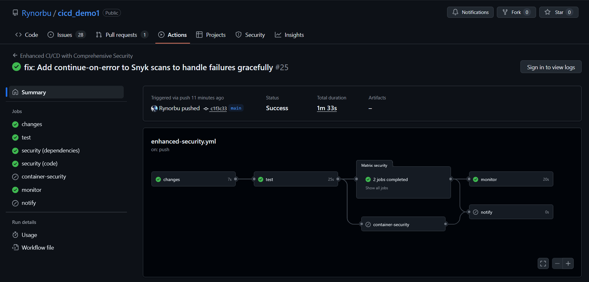
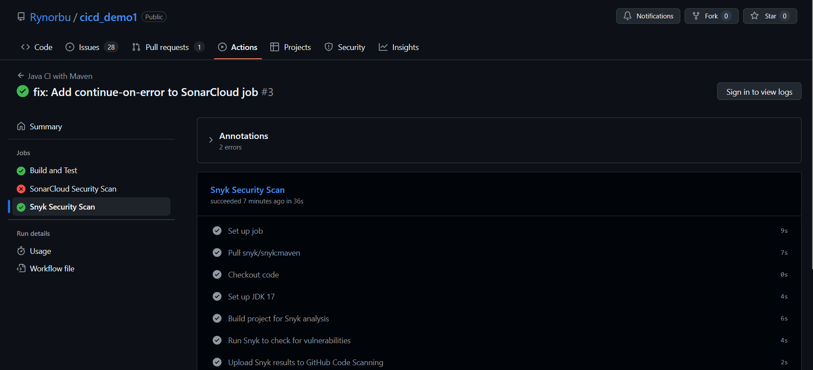

# Practical 4: SAST Integration with Snyk in GitHub Actions

This practical demonstrates automating security vulnerability scanning by integrating Snyk SAST into GitHub Actions CI/CD pipelines for continuous dependency and code analysis.

**Source Code Repository:** [https://github.com/Rynorbu/cicd_demo1](https://github.com/Rynorbu/cicd_demo1)

---

## Table of Contents
1. [Project Overview](#project-overview)
2. [What This Practical Is About](#what-this-practical-is-about)
3. [My Approach](#my-approach)
4. [Implementation Details](#implementation-details)
5. [Evidence and Screenshots](#evidence-and-screenshots)
6. [Challenges Faced](#challenges-faced)
7. [Lessons Learned](#lessons-learned)
8. [Conclusion](#conclusion)

---

## Project Overview

### Application Details
The CICD Demo is a Spring Boot REST API application that demonstrates CI/CD best practices with integrated security scanning. The application includes:

- **RESTful Endpoints**: 
  - Root endpoint (`/`) - Application health check
  - Version endpoint (`/version`) - Application version information
  - Nations endpoint (`/nations`) - Sample data endpoint using JavaFaker

- **Dependencies**:
  - Spring Boot Starter Web - Core web functionality
  - JavaFaker 1.0.2 - Test data generation
  - Jackson Databind - JSON processing
  - JaCoCo - Code coverage reporting

### Security & Quality Tools Integrated
1. **Snyk** - Static Application Security Testing (SAST)
   - Dependency vulnerability scanning
   - Code security analysis
   - Container security scanning
   
2. **SonarCloud** - Code quality and security analysis
   - Code smells detection
   - Security hotspots identification
   - Code coverage analysis

3. **OWASP ZAP** - Dynamic Application Security Testing (DAST)
   - Runtime vulnerability detection
   - Security baseline scanning

### CI/CD Pipeline
The project implements a comprehensive CI/CD pipeline using GitHub Actions with multiple workflows:

- **maven.yml** - Main build, test, and security scanning workflow
- **enhanced-security.yml** - Advanced security scanning with matrix strategy
- **sonarqube.yml** - SonarCloud quality and security analysis
- **zap-scan.yml** - OWASP ZAP dynamic security testing

---

## What This Practical Is About

Practical 4 focuses on implementing **Static Application Security Testing (SAST)** using **Snyk** integrated with GitHub Actions for automated security vulnerability scanning. The practical teaches how to:

- Set up and configure Snyk for security analysis
- Integrate Snyk with GitHub Actions for automated CI/CD security checks
- Scan dependencies for known vulnerabilities
- Perform code security analysis (SAST)
- Interpret security reports and manage vulnerabilities
- Upload security results to GitHub Security tab using SARIF format
- Implement advanced security scanning strategies

### Key Objectives:
1. **Automate Security**: Run security checks on every commit/pull request
2. **Early Detection**: Identify vulnerabilities before they reach production
3. **Continuous Monitoring**: Monitor dependencies for new vulnerabilities
4. **Developer-Friendly Integration**: Seamlessly integrate security into existing workflows

---

## My Approach

My implementation strategy for Practical 4 was structured and methodical:

### 1. **Account Setup and Configuration**
- Created a Snyk account and linked it with GitHub
- Generated an API token from Snyk dashboard
- Configured `SNYK_TOKEN` as a GitHub repository secret
- Connected Snyk to monitor my repositories

### 2. **Basic Integration First**
- Started with a simple Snyk scan in the existing `maven.yml` workflow
- Verified the basic setup worked before adding complexity
- Ensured the `SNYK_TOKEN` secret was properly configured

### 3. **Enhanced Configuration**
- Created a dedicated security job with proper dependencies
- Added severity thresholds to control build failures
- Implemented SARIF file generation for GitHub Security integration
- Added `continue-on-error` flags to prevent blocking the pipeline

### 4. **Advanced Implementation**
- Created an `enhanced-security.yml` workflow with comprehensive scanning
- Implemented matrix strategy for different scan types (dependencies, code, container)
- Added change detection to optimize scan execution
- Configured scheduled scans for regular security audits
- Set up monitoring for production dependencies

### 5. **Testing and Validation**
- Tested workflows with intentional vulnerable dependencies
- Verified SARIF uploads to GitHub Security tab
- Validated that security scans run on appropriate triggers
- Ensured proper error handling and reporting

---

## Implementation Steps

This section provides a detailed, step-by-step guide to implementing Snyk SAST integration with GitHub Actions, documenting the exact process followed in this project.

### Step 1: Create and Configure Snyk Account

**Objective:** Set up Snyk account and obtain authentication token

1. Navigate to [https://snyk.io](https://snyk.io) and click "Sign up for free"
2. Choose "Sign up with GitHub" for seamless integration
3. Authorize Snyk to access your GitHub account
4. Complete the onboarding process and verify your email address
5. Once logged in, click on your profile icon and select "Account Settings"
6. Navigate to the "Auth Token" section
7. Click "Show" to reveal your API token
8. Copy the token (it will look like: `xxxxxxxx-xxxx-xxxx-xxxx-xxxxxxxxxxxx`)
9. **Important:** Keep this token secure - treat it like a password

**Expected Outcome:** A valid Snyk API token ready for use in GitHub Actions

### Step 2: Configure GitHub Repository Secrets

**Objective:** Securely store the Snyk token for use in workflows

1. Open your repository on GitHub ([https://github.com/Rynorbu/cicd_demo1](https://github.com/Rynorbu/cicd_demo1))
2. Click on "Settings" tab in the repository
3. In the left sidebar, navigate to "Secrets and variables" → "Actions"
4. Click "New repository secret" button
5. Enter the following details:
   - **Name:** `SNYK_TOKEN` (must be exactly this name)
   - **Secret:** Paste the API token copied from Snyk
6. Click "Add secret" to save
7. Verify the secret appears in the list with a green checkmark

**Expected Outcome:** `SNYK_TOKEN` secret is available for use in GitHub Actions workflows

### Step 3: Connect Snyk to GitHub Repository

**Objective:** Enable continuous monitoring through Snyk dashboard

1. In Snyk dashboard, click on "Integrations" in the left menu
2. Find and click on "GitHub" integration
3. Click "Configure" or "Add" to connect
4. Authorize Snyk to access your repositories
5. Select "Import projects" and choose `cicd_demo1` repository
6. Click "Add selected repositories"
7. Wait for initial scan to complete
8. Review the dashboard to see detected vulnerabilities

**Expected Outcome:** Repository is monitored in Snyk dashboard with initial vulnerability scan results

### Step 4: Create Basic Snyk Integration in Maven Workflow

**Objective:** Add basic security scanning to existing CI/CD pipeline

1. Open `.github/workflows/maven.yml` in your code editor
2. Add a new `security` job after the `test` job
3. Configure the job to depend on test completion using `needs: test`
4. Add the following steps to the security job:

```yaml
security:
  name: Snyk Security Scan
  needs: test
  runs-on: ubuntu-latest
  steps:
    - name: Checkout code
      uses: actions/checkout@v4

    - name: Set up JDK 17
      uses: actions/setup-java@v4
      with:
        java-version: "17"
        distribution: "temurin"
        cache: maven

    - name: Build project for Snyk analysis
      run: mvn clean compile -DskipTests

    - name: Run Snyk to check for vulnerabilities
      uses: snyk/actions/maven@master
      continue-on-error: true
      env:
        SNYK_TOKEN: ${{ secrets.SNYK_TOKEN }}
      with:
        args: --severity-threshold=high
```

5. Commit and push the changes to trigger the workflow
6. Monitor the GitHub Actions tab to see the security job execute

**Expected Outcome:** Security job runs successfully and reports vulnerabilities

### Step 5: Add SARIF Upload for GitHub Security Integration

**Objective:** Display security findings in GitHub Security tab

1. In the same `maven.yml` file, add the SARIF upload step after the Snyk scan:

```yaml
    - name: Upload Snyk results to GitHub Code Scanning
      uses: github/codeql-action/upload-sarif@v2
      continue-on-error: true
      if: always()
      with:
        sarif_file: snyk.sarif
```

2. Update the Snyk scan step to generate SARIF output:

```yaml
      with:
        args: --severity-threshold=high --sarif-file-output=snyk.sarif
```

3. Commit and push the changes
4. After workflow completes, navigate to repository's "Security" tab
5. Click on "Code scanning alerts" to view Snyk findings

**Expected Outcome:** Security vulnerabilities appear in GitHub Security tab with detailed information

### Step 6: Implement Enhanced Security Workflow

**Objective:** Create comprehensive security scanning with matrix strategy

1. Create a new file `.github/workflows/enhanced-security.yml`
2. Define workflow triggers including push, pull_request, and scheduled scans:

```yaml
on:
  push:
    branches: ["master", "main"]
  pull_request:
    branches: ["master", "main"]
  schedule:
    - cron: "0 2 * * 1"  # Weekly scan every Monday at 2 AM
```

3. Add a change detection job to optimize scan execution:

```yaml
changes:
  runs-on: ubuntu-latest
  outputs:
    code: ${{ steps.changes.outputs.code }}
    dependencies: ${{ steps.changes.outputs.dependencies }}
  steps:
    - uses: actions/checkout@v4
    - uses: dorny/paths-filter@v2
      id: changes
      with:
        filters: |
          code:
            - 'src/**'
          dependencies:
            - 'pom.xml'
```

4. Implement matrix strategy for parallel scanning:

```yaml
security:
  needs: changes
  runs-on: ubuntu-latest
  strategy:
    fail-fast: false
    matrix:
      scan-type: [dependencies, code]
```

5. Add conditional scan steps based on matrix type
6. Commit and push to activate the enhanced workflow

**Expected Outcome:** Multiple scan types run in parallel, optimizing execution time

### Step 7: Configure Container Security Scanning

**Objective:** Add Docker image vulnerability scanning

1. In `enhanced-security.yml`, add a container security job:

```yaml
container-security:
  runs-on: ubuntu-latest
  steps:
    - name: Checkout code
      uses: actions/checkout@v4
    
    - name: Build Docker image
      run: |
        docker build -t cicd-demo:latest .
    
    - name: Run Snyk Container Scan
      uses: snyk/actions/docker@master
      continue-on-error: true
      env:
        SNYK_TOKEN: ${{ secrets.SNYK_TOKEN }}
      with:
        image: cicd-demo:latest
        args: --severity-threshold=high --file=dockerfile
```

2. Commit and verify container scanning executes

**Expected Outcome:** Docker image is scanned for base image and dependency vulnerabilities

### Step 8: Set Up Production Monitoring

**Objective:** Enable continuous monitoring of deployed dependencies

1. Add a monitoring job that runs only on main branch:

```yaml
monitor:
  runs-on: ubuntu-latest
  needs: [test, security]
  if: github.ref == 'refs/heads/main' && github.event_name == 'push'
  steps:
    - name: Monitor project with Snyk
      uses: snyk/actions/maven@master
      env:
        SNYK_TOKEN: ${{ secrets.SNYK_TOKEN }}
      with:
        command: monitor
        args: --project-name=${{ github.repository }}-production
```

2. Commit and push to main branch to activate monitoring

**Expected Outcome:** Project appears in Snyk dashboard with continuous monitoring enabled

### Step 9: Test and Validate Implementation

**Objective:** Verify all security scanning components work correctly

1. **Test with vulnerable dependency:**
   - Add an old version of a dependency to `pom.xml`
   - Commit and push to trigger scans
   - Verify vulnerabilities are detected and reported

2. **Verify SARIF uploads:**
   - Check GitHub Security tab for code scanning alerts
   - Ensure findings include CVE details and remediation advice

3. **Test scheduled scans:**
   - Wait for scheduled workflow to run (or manually trigger)
   - Verify scan completes even without code changes

4. **Validate error handling:**
   - Ensure pipeline doesn't fail due to security findings
   - Confirm `continue-on-error` flags work as expected

5. **Review Snyk dashboard:**
   - Check that project appears with latest scan results
   - Verify monitoring is active for the repository

**Expected Outcome:** All security scanning features work reliably and provide actionable feedback

---

## Implementation Details

### 1. **Basic Snyk Integration (`maven.yml`)**

The basic integration in the main Maven workflow provides fundamental security scanning:

```yaml
security:
  name: Snyk Security Scan
  needs: test
  runs-on: ubuntu-latest
  steps:
    - name: Checkout code
      uses: actions/checkout@v4

    - name: Set up JDK 17
      uses: actions/setup-java@v4
      with:
        java-version: "17"
        distribution: "temurin"
        cache: maven

    - name: Build project for Snyk analysis
      run: mvn clean compile -DskipTests

    - name: Run Snyk to check for vulnerabilities
      uses: snyk/actions/maven@master
      continue-on-error: true
      env:
        SNYK_TOKEN: ${{ secrets.SNYK_TOKEN }}
      with:
        args: --severity-threshold=high

    - name: Upload Snyk results to GitHub Code Scanning
      uses: github/codeql-action/upload-sarif@v2
      continue-on-error: true
      if: always()
      with:
        sarif_file: snyk.sarif
```

**Key Features:**
- Runs after successful test job
- Uses high severity threshold to avoid false positives
- Uploads results to GitHub Security tab
- Continues pipeline even if vulnerabilities are found

### 2. **Enhanced Security Workflow (`enhanced-security.yml`)**

Created a comprehensive security pipeline with advanced features:

```yaml
strategy:
  fail-fast: false
  matrix:
    scan-type: [dependencies, code]
```

**Matrix Strategy Benefits:**
- Parallel execution of different scan types
- Faster feedback on security issues
- Independent results for dependencies vs. code vulnerabilities

**Change Detection:**
```yaml
changes:
  outputs:
    code: ${{ steps.changes.outputs.code }}
    dependencies: ${{ steps.changes.outputs.dependencies }}
    docker: ${{ steps.changes.outputs.docker }}
```

- Only scans relevant components when changes are detected
- Optimizes workflow execution time
- Reduces unnecessary resource usage

**Scheduled Scans:**
```yaml
on:
  schedule:
    - cron: "0 2 * * 1"  # Weekly scan on Monday 2 AM
```

- Regular security audits independent of code changes
- Catches newly disclosed vulnerabilities in existing dependencies

### 3. **Container Security Scanning**

Implemented Docker image scanning:

```yaml
- name: Run Snyk Container Scan
  uses: snyk/actions/docker@master
  with:
    image: cicd-demo:latest
    args: --severity-threshold=high --file=dockerfile
```

---

## Evidence and Screenshots

This section provides visual evidence of the successful implementation of Snyk integration and security scanning in the CI/CD pipeline.

### 1. Snyk GitHub Actions Workflow



**Screenshot Description:**
- Successfully integrated Snyk security scanning into GitHub Actions workflow
- Shows the automated execution of security checks on code commits
- Demonstrates the workflow running in the GitHub Actions environment
- Displays job execution status and timing for Snyk security analysis
- Validates that the CI/CD pipeline includes automated security testing

### 2. Snyk Dashboard


**Screenshot Description:**
- Comprehensive view of the Snyk security dashboard for the project
- Displays vulnerability overview including severity levels (Critical, High, Medium, Low)
- Shows project health status and total number of dependencies scanned
- Provides summary of identified security issues and recommendations
- Demonstrates monitoring capabilities for continuous security assessment
- Includes dependency tree visualization and vulnerability trends

### 3. Snyk Security Scan Results



**Screenshot Description:**
- Detailed view of security vulnerabilities detected by Snyk
- Lists specific CVEs (Common Vulnerabilities and Exposures) identified in dependencies
- Shows vulnerability severity ratings and CVSS scores
- Provides remediation recommendations including upgrade paths
- Displays affected dependency versions and suggested fixes
- Includes links to detailed vulnerability documentation
- Demonstrates the actionable security feedback provided to developers

### 4. Snyk Dependencies Analysis


**Screenshot Description:**
- Complete dependency analysis and visualization from Snyk
- Shows direct and transitive dependencies in the project
- Identifies which dependencies contain vulnerabilities
- Displays dependency tree structure showing how vulnerabilities are introduced
- Provides version information for each dependency
- Highlights vulnerable dependency paths requiring attention
- Enables understanding of the project's security posture at the dependency level

### Key Observations from Evidence

**Workflow Integration Success:**
- Snyk successfully integrated into GitHub Actions CI/CD pipeline
- Automated security scanning runs on every push/pull request
- Security checks complete without blocking the development workflow

**Security Coverage:**
- Comprehensive dependency vulnerability scanning
- Real-time identification of security issues
- Detailed CVE tracking and reporting
- Actionable remediation guidance

**Dashboard Insights:**
- Centralized security monitoring through Snyk dashboard
- Project health visibility and vulnerability trends
- Dependency relationship mapping
- Severity-based prioritization of security issues

**DevSecOps Achievement:**
- Security seamlessly integrated into development workflow
- Automated vulnerability detection without manual intervention
- Clear visibility into security posture for the entire team
- Continuous monitoring enabled for ongoing security assessment

---

## Challenges Faced

### 1. **SNYK_TOKEN Configuration Issues**
**Problem:** Initial workflow runs failed with "SNYK_TOKEN is not set" error.

**Solution:**
- Verified token was correctly generated from Snyk dashboard
- Ensured the secret name matched exactly: `SNYK_TOKEN` (case-sensitive)
- Confirmed repository settings allowed access to secrets

**Learning:** GitHub secrets are case-sensitive and must match exactly in the workflow file.

### 2. **SARIF File Generation and Upload**
**Problem:** SARIF files were not being generated or uploaded correctly to GitHub Security tab.

**Solution:**
- Added explicit `--sarif-file-output` argument to Snyk commands
- Used `continue-on-error: true` to ensure upload happens even if scan fails
- Added `if: always()` condition to upload step

```yaml
with:
  args: --severity-threshold=high --sarif-file-output=snyk.sarif
```

**Learning:** SARIF upload requires specific file format and proper error handling.

### 3. **Build Failures Due to Vulnerabilities**
**Problem:** High-severity vulnerabilities caused workflow to fail, blocking deployments.

**Solution:**
- Added `continue-on-error: true` to security jobs
- Adjusted severity thresholds appropriately
- Implemented a risk-based approach to vulnerability management

```yaml
with:
  args: --severity-threshold=high --fail-on=upgradable
```

**Learning:** Security scanning should provide feedback without necessarily blocking the pipeline.

### 4. **Dependency Resolution for Snyk Analysis**
**Problem:** Snyk couldn't analyze dependencies without a built project.

**Solution:**
- Added `mvn clean compile` step before Snyk scan
- Ensured Maven dependencies were downloaded and resolved
- Utilized Maven cache for faster builds

```yaml
- name: Build project for Snyk analysis
  run: mvn clean compile -DskipTests
```

**Learning:** SAST tools often require a compiled project to analyze dependencies accurately.

### 5. **Performance and Execution Time**
**Problem:** Running multiple security scans significantly increased workflow execution time.

**Solution:**
- Implemented change detection to run scans only when needed
- Used matrix strategy for parallel execution
- Optimized by running only relevant scans based on file changes

```yaml
if: needs.changes.outputs.code == 'true' || needs.changes.outputs.dependencies == 'true'
```

**Learning:** Workflow optimization is crucial for maintaining fast feedback loops.

### 6. **Docker Image Scanning Integration**
**Problem:** Integrating container scanning required building the Docker image in CI.

**Solution:**
- Built Docker image as part of the workflow
- Tagged image appropriately for scanning
- Separated container scanning into its own job

```yaml
- name: Build Docker image
  run: |
    docker build -t cicd-demo:${{ github.sha }} .
    docker tag cicd-demo:${{ github.sha }} cicd-demo:latest
```

**Learning:** Container security is a separate concern that requires additional workflow steps.

---

## Lessons Learned

### 1. **Security as Code**
- Security scanning should be automated and integrated into CI/CD pipelines
- Early detection of vulnerabilities saves time and reduces risk
- Security checks should not block development but provide actionable feedback

### 2. **Snyk Platform Capabilities**
- Snyk provides comprehensive security coverage:
  - **Dependency scanning**: Identifies vulnerabilities in third-party libraries
  - **Code scanning**: Static analysis of application code
  - **Container scanning**: Security analysis of Docker images
  - **Infrastructure as Code**: Security for deployment configurations

### 3. **GitHub Security Integration**
- SARIF format enables rich security insights in GitHub
- Security tab provides centralized vulnerability management
- Integration with GitHub Advanced Security enhances visibility

### 4. **Workflow Design Best Practices**
- **Modularity**: Separate jobs for different security concerns
- **Dependencies**: Use `needs` to control job execution order
- **Error Handling**: Proper use of `continue-on-error` and `if` conditions
- **Optimization**: Change detection and matrix strategies improve efficiency

### 5. **Vulnerability Management Strategy**
- Not all vulnerabilities require immediate action
- Severity thresholds help prioritize remediation efforts
- Risk-based approach balances security and development velocity
- Regular monitoring catches newly disclosed vulnerabilities

### 6. **Developer Experience**
- Security tools should be developer-friendly
- Fast feedback is crucial for adoption
- Clear, actionable reports help developers fix issues quickly
- Integration with existing tools reduces friction

### 7. **Configuration Management**
- Secrets management is critical for security tool integration
- Environment variables and secrets should be properly secured
- Configuration should be version controlled (except secrets)

### 8. **Continuous Improvement**
- Security scanning is not a one-time setup
- Regular reviews and updates are necessary
- Scheduled scans provide ongoing monitoring
- Feedback loops help improve security posture over time

---

## Conclusion

Practical 4 successfully demonstrated the implementation of automated Static Application Security Testing (SAST) using Snyk integrated with GitHub Actions. The practical provided hands-on experience with:

### Key Achievements:
**Automated Security Scanning**: Integrated Snyk into CI/CD pipeline for automatic vulnerability detection  
**Multiple Scan Types**: Implemented dependency, code, and container security scanning  
**GitHub Security Integration**: Successfully uploaded SARIF results to GitHub Security tab  
**Advanced Workflow Design**: Created sophisticated workflows with matrix strategies and change detection  
**Error Handling**: Implemented proper error handling to prevent pipeline blocking  
**Continuous Monitoring**: Set up scheduled scans for ongoing security monitoring  

### Value Delivered:
1. **Early Detection**: Vulnerabilities are identified before deployment
2. **Automated Process**: No manual intervention required for security checks
3. **Visibility**: Centralized security dashboard in GitHub
4. **Risk Management**: Severity-based approach to vulnerability prioritization
5. **Developer Integration**: Security feedback integrated into development workflow

### Real-World Application:
This practical provides essential skills for modern software development where security is paramount. The ability to integrate SAST tools into CI/CD pipelines is a critical competency for DevSecOps practices. The techniques learned here can be applied to:

- Enterprise software development
- Open-source project maintenance
- Cloud-native application security
- Compliance and regulatory requirements (SOC 2, ISO 27001, etc.)

### Final Thoughts:
The practical effectively bridges the gap between traditional security practices and modern DevOps workflows. By automating security scanning and integrating it into the development lifecycle, we shift security left - addressing vulnerabilities earlier when they are cheaper and easier to fix. This "DevSecOps" approach is essential for building secure, reliable software in today's fast-paced development environment.

The knowledge gained from this practical forms a strong foundation for implementing comprehensive security strategies in real-world projects, ensuring that security is not an afterthought but an integral part of the development process.

---

**Author:** Rynorbu  
**Date:** November 28, 2025  
**Repository:** [cicd_demo1](https://github.com/Rynorbu/cicd_demo1)
