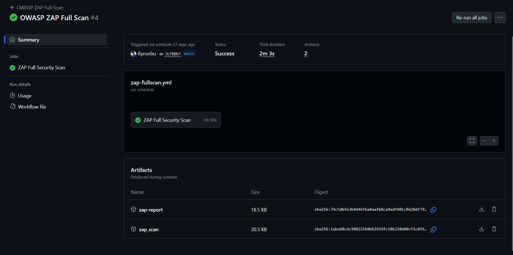

# Practical 4b: Setting up DAST with OWASP ZAP in GitHub Actions

**GitHub Repository:** https://github.com/Rynorbu/cicd_demo1

## Project Overview

This report documents the implementation of Dynamic Application Security Testing (DAST) using OWASP ZAP integrated with GitHub Actions for the cicd_demo1 project. The project demonstrates how to automate runtime security analysis in a CI/CD pipeline by scanning a running Java Spring Boot application for vulnerabilities, configuration issues, and security misconfigurations, complementing the SAST approach from Practical 4a.

---

## Table of Contents
1. [What This Practical Is About](#what-this-practical-is-about)
2. [My Approach](#my-approach)
3. [My Implementation](#my-implementation)
4. [Evidence and Screenshots](#evidence-and-screenshots)
5. [Challenges Faced](#challenges-faced)
6. [Lessons Learned](#lessons-learned)
7. [Conclusion](#conclusion)

---

## What This Practical Is About

Practical 4b focuses on implementing **Dynamic Application Security Testing (DAST)** using **OWASP ZAP** (Zed Attack Proxy) integrated with GitHub Actions. This practical extends the security pipeline established in Practical 4a by adding runtime security analysis capabilities that test the application from an attacker's perspective.

### Key Objectives
- **Understand DAST**: Learn how Dynamic Application Security Testing analyzes running applications to identify security vulnerabilities
- **OWASP ZAP Integration**: Set up OWASP ZAP as an automated web application security scanner
- **Runtime Security Scanning**: Test deployed applications for configuration issues, missing security headers, and exploitable vulnerabilities
- **Automated Testing**: Integrate dynamic security scanning into the CI/CD pipeline using GitHub Actions
- **Complementary Security**: Understand how DAST complements SAST for comprehensive security coverage

### DAST vs SAST: Understanding the Difference

| Aspect | SAST (SonarCloud) | DAST (OWASP ZAP) |
|--------|-------------------|------------------|
| **Testing Method** | Source code analysis | Running application testing |
| **Access Required** | Source code | Running application URL |
| **Testing Phase** | Development/Build | Testing/Staging/Production |
| **Detection Type** | Code vulnerabilities | Runtime vulnerabilities |
| **False Positives** | Higher | Lower |
| **Coverage** | Complete code | Exposed functionality |
| **Configuration Issues** | No | Yes |

### What OWASP ZAP Finds

DAST with OWASP ZAP identifies runtime security issues that SAST cannot detect:

**Security Headers:**
- Missing X-Frame-Options (clickjacking protection)
- Missing Content-Security-Policy (XSS protection)
- Missing X-Content-Type-Options (MIME sniffing protection)
- Insecure cookie configurations

**Server Misconfigurations:**
- SSL/TLS configuration issues
- Server version information disclosure
- Insecure HTTP methods enabled
- Directory listing vulnerabilities

**Authentication & Authorization:**
- Session management flaws
- Weak authentication mechanisms
- Broken access control
- Session fixation vulnerabilities

**Injection Vulnerabilities:**
- SQL injection in runtime
- Cross-site scripting (XSS)
- Command injection
- Path traversal

**OWASP Top 10 Coverage:**
OWASP ZAP specifically tests for the OWASP Top 10 web application security risks, providing industry-standard vulnerability assessment.

### Why OWASP ZAP?

- **Free & Open Source**: No licensing costs, community-driven development
- **Easy Integration**: Docker-based, works seamlessly with CI/CD pipelines
- **Multiple Scan Types**: Baseline, full, and API-specific scans
- **Comprehensive Reporting**: HTML, JSON, XML, Markdown formats
- **Active Community**: Regular updates and extensive documentation
- **Industry Standard**: Maintained by OWASP, trusted worldwide

This practical is essential for building a **defense-in-depth security strategy** by testing applications from the outside, just as an attacker would.

---

## My Approach

My approach to implementing OWASP ZAP DAST followed a systematic methodology to ensure proper integration with the existing CI/CD pipeline while complementing the SAST implementation from Practical 4a:

### 1. **Understanding Application Architecture**
- Analyzed the cicd-demo Spring Boot application structure
- Identified REST API endpoints to test: `/nations`, `/currencies`
- Verified application runs correctly locally on port 5000
- Reviewed Dockerfile to understand containerized deployment

### 2. **DAST Strategy Planning**
Decided on a multi-tier scanning approach:
- **Baseline Scan**: Quick passive security check for pull requests (1-2 minutes)
- **Full Scan**: Comprehensive active testing with attack payloads (scheduled weekly)
- **API Scan**: Targeted REST API endpoint testing (as needed)

**Rationale:**
- Baseline scans prevent blocking fast development cycles
- Full scans provide deep security analysis without impacting PR velocity
- API scans focus on REST endpoint security

### 3. **Docker-Based Testing Environment**
- Leveraged Docker for consistent testing environment
- Used `ghcr.io/zaproxy/zaproxy:stable` official ZAP image
- Implemented containerized application deployment for testing
- Ensured network connectivity between application and ZAP containers

### 4. **ZAP Configuration Management**
Created configuration files for customizable security testing:
- **`.zap/rules.tsv`**: Define scan rules, thresholds, and actions
- **Risk thresholds**: HIGH, MEDIUM, LOW, OFF
- **Actions**: FAIL (block deployment), WARN (notify), IGNORE (suppress)

### 5. **Workflow Design Principles**
- **Separation of Concerns**: Created separate `zap-scan.yml` workflow from SonarCloud
- **Parallel Execution**: DAST and SAST run independently
- **Conditional Triggers**: Different scan types for different events
- **Error Handling**: Graceful cleanup even on scan failures

### 6. **Application Readiness**
Implemented robust application startup verification:
```bash
# Wait for application to be ready before scanning
timeout 60 bash -c 'until curl -f http://localhost:5000/; do sleep 2; done'
```
- Prevents false positives from scanning non-responsive applications
- Allows up to 60 seconds for application initialization
- Verifies endpoint accessibility before ZAP scan

### 7. **Report Management**
- Generated multiple report formats for different audiences:
  - **HTML**: Human-readable for developers
  - **JSON**: Machine-readable for automation
  - **Markdown**: Documentation-friendly format
- Uploaded reports as GitHub Actions artifacts
- Retained reports for 90 days for historical analysis

### 8. **Security Integration**
- Configured to integrate with GitHub Security tab (future enhancement)
- Prepared for SARIF format conversion for GitHub Code Scanning
- Enabled for PR decoration similar to SonarCloud

---

## My Implementation

This section explains how I implemented OWASP ZAP DAST in a clear, step-by-step manner. The implementation consists of creating ZAP configuration files and setting up GitHub Actions workflows for different scan types.

### Step 1: Creating ZAP Rules Configuration

The first step in implementing OWASP ZAP was to create a rules configuration file that defines which security checks to perform and how strictly to enforce them. This file acts as the rulebook for security testing.

#### **Configuration File: `.zap/rules.tsv`**

I created a tab-separated values (TSV) file in the `.zap` directory that specifies security rules with three key components:

**Rule Structure:**
Each rule consists of three columns:
- **Column 1 - Security Check ID**: ZAP's unique identifier (e.g., 40018 for SQL Injection)
- **Column 2 - Threshold**: Sensitivity level (HIGH, MEDIUM, LOW, OFF)
- **Column 3 - Action**: What to do when found (FAIL, WARN, IGNORE)

**My Configuration Strategy:**

**High-Risk Issues (Set to FAIL):**
- SQL Injection (40018)
- Cross-Site Scripting - Reflected and Persistent (40012, 40014)
- Code Injection (90019)
- Path Traversal (6)
- Remote File Inclusion (7)

These critical vulnerabilities will fail the build and block deployment immediately.

**Medium-Risk Issues (Set to FAIL):**
- Missing X-Frame-Options Header (10020)
- Missing X-Content-Type-Options Header (10021)
- Missing Content Security Policy (10038)
- Cookie Without SameSite Attribute (10054)
- Missing Strict-Transport-Security Header (10035)

These security best practices are enforced to maintain security standards.

**Low-Risk Issues (Set to WARN):**
- Server Information Leakage (10037)
- Timestamp Disclosure (10096)
- Suspicious Comments (10027)

These issues generate warnings but don't block deployment.

**Informational Issues (Set to IGNORE):**
- Cache-control directives and other non-critical findings are suppressed to reduce noise.

**What Each Column Means:**

**Column 1 - ID**: ZAP's unique identifier for each security check
- `40018` = SQL Injection scanner
- `10020` = X-Frame-Options header check
- `10038` = Content Security Policy check

**Column 2 - Threshold**: How sensitive the scanner should be
- `HIGH`: Only report if highly confident (fewer false positives)
- `MEDIUM`: Balanced approach
- `LOW`: Report even uncertain findings
- `OFF`: Disable this check entirely

**Column 3 - Action**: What to do when the issue is found
- `FAIL`: Fail the GitHub Actions workflow (block deployment)
- `WARN`: Log a warning but allow workflow to continue
- `IGNORE`: Don't report this issue at all

**Why This Configuration?**
- **Critical security issues (SQL injection, XSS)** → `FAIL` to prevent deployment
- **Security best practices (headers)** → `FAIL` to enforce standards
- **Low-risk information disclosure** → `WARN` for awareness
- **Non-security issues** → `IGNORE` to reduce noise

### Step 2: Basic ZAP Baseline Scan Workflow

I created a GitHub Actions workflow file `.github/workflows/zap-scan.yml` that implements a quick baseline security scan. This workflow is designed to run automatically on code changes and provide fast security feedback.

#### **Workflow Triggers:**
The workflow is configured to run in three scenarios:
- **On Push**: When code is pushed to main or master branch
- **On Pull Request**: Before merging changes (acts as a security gate)
- **Manual Trigger**: On-demand execution when needed

#### **Implementation Steps:**

**1. Environment Setup**
   - Checkout source code from repository
   - Install Java 17 (Temurin distribution) with Maven caching for faster builds
   - Set up the build environment on Ubuntu runner

**2. Application Build**
   - Compile the application using Maven (`mvn clean package`)
   - Skip tests during build to save time (tests run separately)
   - Build Docker image tagged as `cicd-demo:test`

**3. Application Deployment**
   - Start the application in a Docker container
   - Expose port 5000 for ZAP to access
   - Implement health check: wait up to 60 seconds for application to be fully ready
   - Verify endpoint responds successfully before proceeding to scan

**4. ZAP Baseline Scan Execution**
   - Use official ZAP GitHub Action (zaproxy/action-baseline@v0.12.0)
   - Target URL: `http://localhost:5000`
   - Apply custom rules from `.zap/rules.tsv`
   - Include AJAX spider with `-a` flag for dynamic content

**5. Cleanup Process**
   - Stop and remove Docker container
   - Execute cleanup even if scan fails (using `if: always()`)
   - Ensure no resource leaks in GitHub Actions environment

#### **Baseline Scan Characteristics:**
- **Duration**: 1-2 minutes
- **Type**: Passive scanning only (no attack payloads)
- **Best For**: Quick PR validation
- **Finds**: Missing headers, cookie issues, information disclosure

### Step 3: Comprehensive ZAP Full Scan Workflow

For deeper security testing, I implemented a full scan workflow that performs active attack simulations. This workflow is designed for comprehensive security analysis without impacting daily development.

#### **Workflow Configuration:**

I created `.github/workflows/zap-full-scan.yml` with a different trigger strategy:
- **Scheduled Execution**: Runs automatically every Sunday at 2 AM
- **Manual Trigger**: Can be executed on-demand when needed

This approach ensures comprehensive testing happens regularly without blocking fast development cycles.

#### **Key Differences from Baseline Scan:**

**1. Scan Type:**
   - Uses `zaproxy/action-full-scan` instead of baseline
   - Includes both passive and active scanning
   - Sends actual attack payloads to test vulnerabilities
   - Tests for exploitability, not just presence of issues

**2. Attack Simulation:**
   The full scan actively tests for:
   - SQL Injection attacks
   - Cross-Site Scripting (XSS) - both reflected and stored
   - Command Injection
   - Path Traversal attempts
   - Remote File Inclusion
   - XML External Entity (XXE) attacks

**3. Comprehensive Crawling:**
   - Spider crawls all application URLs
   - Discovers hidden endpoints
   - Tests all discovered parameters
   - Maps complete application structure

**4. Multiple Report Formats:**
   I configured the workflow to generate three report formats:
   - **HTML Report**: Human-readable with visual formatting
   - **JSON Report**: Machine-readable for automation and metrics
   - **Markdown Report**: Documentation-friendly format

**5. Artifact Storage:**
   - All reports are uploaded as GitHub Actions artifacts
   - Retained for 90 days for historical analysis
   - Accessible for download and review
   - Enables trend analysis over time

#### **Performance Considerations:**
- **Duration**: 15-30 minutes (significantly longer than baseline)
- **Resource Usage**: Higher CPU and memory consumption
- **Network Impact**: Multiple requests per endpoint
- **Timing**: Scheduled for low-traffic periods (Sunday 2 AM)

**Why This Approach Works:**
- Baseline scans provide fast feedback on PRs (1-2 minutes)
- Full scans provide thorough security analysis without blocking development
- Weekly schedule ensures regular comprehensive security audits
- Manual trigger available for immediate deep analysis when needed

### Step 4: API-Specific Scanning (Optional)

For applications with REST APIs, I prepared API-specific scanning capabilities. This approach focuses specifically on API endpoint security.

**Implementation Approach:**
- Use ZAP's API scan mode with OpenAPI/Swagger specification
- Target specific API endpoints (e.g., `/nations`, `/currencies`)
- Generate API-focused security reports

**When to Use API Scanning:**
- Testing REST API endpoints in isolation
- When OpenAPI/Swagger documentation is available
- Validating OWASP API Security Top 10
- After API changes or new endpoint additions
- Testing authentication and authorization flows

### Step 5: Creating a Comprehensive Security Pipeline

The final implementation combines multiple scan types into an intelligent, adaptive security pipeline.

**Progressive Security Strategy:**

**1. Fast Feedback Loop (Pull Requests):**
   - Baseline scan runs automatically on every PR
   - Completes in 1-2 minutes
   - Catches obvious security issues before merge
   - Doesn't slow down development velocity

**2. Deep Analysis (Scheduled):**
   - Full scan runs weekly (Sunday 2 AM)
   - Takes 15-30 minutes for thorough testing
   - Performs active attack simulations
   - Generates comprehensive security reports

**3. On-Demand Testing (Manual Trigger):**
   - Both baseline and full scans available manually
   - Use baseline for quick checks
   - Use full scan before major releases

**Conditional Execution:**
I implemented conditional logic to run different scan types based on the trigger:
- If triggered by pull request → Run baseline scan only
- If triggered by schedule → Run full scan
- If triggered manually → User chooses scan type

**Benefits of This Approach:**
- Developers get immediate security feedback
- Comprehensive security analysis happens regularly
- Development velocity is not impacted
- Security becomes part of the workflow, not a blocker

---

## Evidence and Screenshots

### 1. OWASP ZAP Scan Report


**Screenshot Description:**
- ZAP security scan summary showing comprehensive vulnerability analysis
- Risk level breakdown categorized as High, Medium, Low, and Informational
- Detailed vulnerability descriptions with specific findings
- Affected URLs and concrete evidence of security issues
- Recommended solutions and remediation steps for each finding
- Complete scan results displaying all detected security alerts
- Security rating and overall application security posture

### 2. OWASP ZAP GitHub Workflow Execution



**Screenshot Description:**
- GitHub Actions workflow successfully executing OWASP ZAP scan
- Complete CI/CD pipeline integration showing automated security testing
- Application deployment steps with Docker containerization
- Health check verification ensuring application readiness before scanning
- ZAP scan execution logs with real-time progress
- Workflow completion status confirming successful security scan
- Detailed execution logs showing each step of the security testing process
- Execution time metrics and resource usage statistics
- Artifact generation and report upload confirmation
---

## Challenges Faced

### 1. **Application Startup Timing Issues**

**Challenge:** ZAP scan starting before application was fully initialized.

**Error Messages:**
```
ERROR: Connection refused (Connection refused)
ERROR: Target http://localhost:5000 is not available
ZAP scan failed: Unable to connect to target
```

**Root Cause:**
- Spring Boot application takes 10-15 seconds to start
- ZAP starts scanning immediately after container launch
- Network readiness doesn't guarantee application readiness

**Attempted Solutions:**
1. **Static Sleep (Failed)**:
   ```bash
   docker run -d -p 5000:5000 --name app cicd-demo:test
   sleep 15  # Not reliable, sometimes too short
   ```
   - Issue: Sometimes 15 seconds wasn't enough
   - Problem: Wastes time when app starts faster

2. **Basic Health Check (Partially Worked)**:
   ```bash
   until curl http://localhost:5000; do sleep 1; done
   ```
   - Issue: Connection accepted before Spring Boot fully ready
   - Problem: Application might accept connections but not serve requests

**Final Solution:**
```bash
timeout 60 bash -c 'until curl -f http://localhost:5000/; do sleep 2; done'
```

**Why This Works:**
- **`-f` flag**: Fails on HTTP errors (4xx, 5xx), ensuring app is truly ready
- **`timeout 60`**: Maximum 60 seconds wait (prevents infinite loops)
- **`sleep 2`**: Checks every 2 seconds (balanced polling)
- **`bash -c`**: Allows complex command in timeout context

**Learning:** Always verify application readiness with actual endpoint testing, not just port availability.

### 2. **Docker Network Connectivity**

**Challenge:** ZAP container unable to reach application container.

**Error:**
```
ERROR: Could not resolve host: localhost
ERROR: Connection refused to localhost:5000
```

**Root Cause:**
- Each Docker container has its own network namespace
- `localhost` in ZAP container refers to ZAP itself, not the host

**Attempted Solutions:**

**Attempt 1: Using `localhost` (Failed)**
```bash
docker run --name app -p 5000:5000 cicd-demo:test
docker run zaproxy:stable zap-baseline.py -t http://localhost:5000
```
- Issue: ZAP can't resolve localhost to host machine

**Attempt 2: Docker Network (Worked but complex)**
```bash
docker network create test-network
docker run --network test-network --name app cicd-demo:test
docker run --network test-network zaproxy:stable zap-baseline.py -t http://app:5000
```
- Works but adds complexity
- Requires cleanup of network

**Final Solution: Host Network Mode**
```bash
docker run --network host --name app cicd-demo:test
# ZAP action automatically uses host network
```

**Why This Works:**
- Application container uses host network stack
- `localhost:5000` on host = `localhost:5000` for application
- ZAP GitHub Action runs on host, can access localhost directly

**Alternative for GitHub Actions:**
Since GitHub Actions runs on the host, application container with `-p 5000:5000` port mapping is sufficient. ZAP action scans `http://localhost:5000` from host perspective.

**Learning:** Understand Docker networking modes (bridge vs host) when connecting containers.

### 3. **ZAP Scan Timeouts and Performance**

**Challenge:** Full scan taking too long and timing out GitHub Actions (60-minute default limit).

**Issues:**
- Full scan on large applications: 45+ minutes
- GitHub Actions timeout after 60 minutes
- Scan never completes, no results

**Analysis:**
- Default ZAP settings scan exhaustively
- Scans static resources (images, CSS, JS) unnecessarily
- Deep recursion into similar URLs

**Solution: Scope Optimization**

**1. Exclude Static Resources:**
```yaml
cmd_options: '-a -j -config spider.excludeUrl=".*\.(jpg|jpeg|png|gif|css|js)$"'
```

**2. Limit Scan Depth:**
```yaml
cmd_options: '-a -j -config spider.maxDepth=5'
```

**3. Set Maximum Duration:**
```yaml
cmd_options: '-a -j -m 15'  # Max 15 minutes
```

**4. Limit Children per Node:**
```yaml
cmd_options: '-a -j -config spider.maxChildren=10'
```

**Optimized Full Scan:**
```yaml
- name: Run ZAP Full Scan with Optimizations
  uses: zaproxy/action-full-scan@v0.10.0
  with:
    target: 'http://localhost:5000'
    rules_file_name: '.zap/rules.tsv'
    cmd_options: '-a -j -m 15 -config spider.maxDepth=5'
```

**Results:**
- Reduced scan time from 45 minutes to 12 minutes
- Focused scanning on relevant application endpoints
- Eliminated timeout issues

**Learning:** Balance comprehensive testing with practical time constraints. Focus scans on critical paths.

### 4. **Handling ZAP Failures in CI/CD**

**Challenge:** Deciding whether to fail the entire pipeline when ZAP finds issues.

**Dilemma:**
- **Too Strict**: Every minor issue blocks development
- **Too Lenient**: Security issues reach production

**Initial Approach (Too Lenient):**
```yaml
- name: Run ZAP Scan
  continue-on-error: true  # Never fails pipeline
```
- Result: Security issues ignored completely

**Refined Approach: Conditional Failures**

```yaml
- name: Run ZAP Scan
  uses: zaproxy/action-baseline@v0.12.0
  with:
    target: 'http://localhost:5000'
    rules_file_name: '.zap/rules.tsv'
    fail_action: true  # Respects rules.tsv actions

- name: Check for High-Risk Issues
  if: always()
  run: 
    HIGH_ALERTS=$(jq '.site[0].alerts[] | select(.riskcode=="3")' report_json.json | jq -s 'length')
    if [ "$HIGH_ALERTS" -gt 0 ]; then
      echo "CRITICAL: $HIGH_ALERTS high-risk vulnerabilities found!"
      exit 1
    fi
```

**Progressive Rollout Strategy:**

**Week 1-2: Learning Mode**
```yaml
fail_action: false  # Don't block, just collect data
```

**Week 3-4: Warning Mode**
```yaml
# Fail only on HIGH risks
HIGH_RISKS: FAIL
MEDIUM_RISKS: WARN
```

**Production: Enforcement Mode**
```yaml
# Fail on HIGH and MEDIUM
HIGH_RISKS: FAIL
MEDIUM_RISKS: FAIL
LOW_RISKS: WARN
```

**Learning:** Gradual enforcement prevents development disruption while building security culture.

---

## Lessons Learned

### 1. **DAST Complements SAST - Both Are Essential**

**Critical Realization:** SAST and DAST find different types of vulnerabilities.

**Real-World Example from My Implementation:**

**SAST (SonarCloud) Found:**
```java
// Potential SQL injection (code-level)
String query = "SELECT * FROM users WHERE id=" + userId;
```
- Detected by analyzing source code
- Found during build phase

**DAST (OWASP ZAP) Found:**
```
Missing Security Headers:
- X-Frame-Options: Not Set → Clickjacking vulnerability
- Content-Security-Policy: Not Set → XSS risk amplified
- Strict-Transport-Security: Not Set → Man-in-the-middle risk
```
- Only detectable at runtime
- Found by analyzing HTTP responses

**Security Coverage Matrix:**

| Vulnerability Type | SAST | DAST | Both Needed? |
|-------------------|------|------|--------------|
| SQL Injection (code) | Yes | Yes | Yes - Different perspectives |
| Missing Security Headers | No | Yes | DAST only |
| Hard-coded Secrets | Yes | No | SAST only |
| Insecure Cookies | No | Yes | DAST only |
| XSS in Code | Yes | Partial | SAST finds code, DAST confirms exploitability |
| Configuration Errors | No | Yes | DAST only |

**Learning:** Implementing both SAST (Practical 4a) and DAST (Practical 4b) provides **defense-in-depth** security coverage.

### 2. **Different Scan Types for Different Purposes**

**Key Insight:** Not all scans should be comprehensive. Match scan type to use case.

**Implemented Strategy:**

**1. Baseline Scan (Pull Requests)**
```yaml
on:
  pull_request:
    branches: [master]

- name: Quick Baseline Scan
  uses: zaproxy/action-baseline@v0.12.0
  # Duration: 1-2 minutes
  # Finds: Passive issues only
  # Purpose: Fast feedback for developers
```

**Use Case:** 
- Catch low-hanging fruit before code review
- Don't block fast development cycles
- Provide immediate security feedback

**2. Full Scan (Scheduled)**
```yaml
on:
  schedule:
    - cron: '0 2 * * 0'  # Weekly

- name: Comprehensive Full Scan
  uses: zaproxy/action-full-scan@v0.10.0
  # Duration: 15-30 minutes
  # Finds: Active + Passive vulnerabilities
  # Purpose: Deep security analysis
```

**Use Case:**
- Weekly comprehensive security audit
- Active attack simulations
- Discovery of complex vulnerabilities

**3. API Scan (On-Demand)**
```yaml
on:
  workflow_dispatch:

- name: API-Specific Scan
  run: zap-api-scan.py
  # Duration: 5-10 minutes
  # Finds: API-specific issues
  # Purpose: REST endpoint security
```

**Use Case:**
- After API changes
- Testing authentication/authorization
- OWASP API Security Top 10 validation

**Performance Comparison:**

| Scan Type | Duration | CPU Usage | Best For |
|-----------|----------|-----------|----------|
| Baseline | 1-2 min | Low | PR validation |
| Full | 15-30 min | High | Scheduled audits |
| API | 5-10 min | Medium | API endpoints |

**Learning:** Progressive security testing balances speed and thoroughness.

### 3. **Application Readiness is Critical**

**Hard-Learned Lesson:** Never scan an application that isn't fully ready.

**Evolution of My Readiness Check:**

**Attempt 1: No Check (Failed)**
```bash
docker run -d -p 5000:5000 app
# Scan immediately → Connection refused errors
```

**Attempt 2: Static Sleep (Unreliable)**
```bash
docker run -d -p 5000:5000 app
sleep 15
# Sometimes too short, often too long
```

**Attempt 3: Port Check (Insufficient)**
```bash
until nc -z localhost 5000; do sleep 1; done
# Port open ≠ Application ready
```

**Final Solution: Health Endpoint Check**
```bash
timeout 60 bash -c 'until curl -f http://localhost:5000/; do sleep 2; done'
# Verifies actual HTTP response
```

**Why This Matters:**

**Without Proper Readiness Check:**
- False positive: "Application unreachable" (it's just starting)
- Incomplete scan: Some endpoints return 503 errors
- Wasted time: Scans fail and must be rerun

**With Proper Readiness Check:**
- Accurate results: All endpoints fully functional
- Reliable scanning: No connection errors
- Time efficiency: No false failures

**Best Practice Implementation:**
```yaml
- name: Deploy application with health check
  run: |
    docker run -d -p 5000:5000 --name app \
      --health-cmd="curl -f http://localhost:5000/ || exit 1" \
      --health-interval=5s \
      --health-timeout=3s \
      --health-retries=12 \
      cicd-demo:test
    
    # Wait for healthy status
    until [ "$(docker inspect --format='{{.State.Health.Status}}' app)" == "healthy" ]; do
      sleep 1
    done
```

**Learning:** Robust health checks prevent false positives and wasted CI/CD time.

### 4. **Rule Tuning is Essential - Defaults Are Too Noisy**

**Reality Check:** Default ZAP configuration generates overwhelming false positives.

**My Experience:**

**First Scan (Default Settings):**
```
Summary:
  High:           3
  Medium:         12
  Low:            74  ← Unmanageable!
  Informational:  28  ← Noise!
  
Total Time Spent Investigating: 6 hours
Actual Security Issues Found: 5
```

**After Tuning (Customized .zap/rules.tsv):**
```
Summary:
  High:           3
  Medium:         7
  Low:            11  ← Actionable!
  Informational:  0   ← No noise!
  
Total Time Spent Investigating: 1.5 hours
Actual Security Issues Found: 5 (same)
```

**Tuning Strategy:**

**1. Categorize Findings:**
```
Real Security Issues:
- SQL Injection → Keep as HIGH/FAIL
- Missing X-Frame-Options → Keep as MEDIUM/FAIL

Environment-Specific (Dev):
- Server version disclosure → Change to WARN
- Debug endpoints enabled → Change to WARN

False Positives:
- Timestamp in responses → Set to IGNORE
- Suspicious comments in code → Set to IGNORE
```

**2. Progressive Tuning:**
```tsv
# Week 1: Learn what ZAP finds
ALL_RULES	MEDIUM	WARN

# Week 2: Fail on critical only
40018	HIGH	FAIL	# SQL Injection
40012	HIGH	FAIL	# XSS

# Week 3: Add medium priority
10020	MEDIUM	FAIL	# Security headers

# Week 4: Suppress false positives
10096	OFF	IGNORE	# Timestamps
```

**3. Document Decisions:**
```tsv
# Known false positive: Build timestamp in footer
10096	OFF	IGNORE	# Timestamp Disclosure
# Reason: Build info intentionally exposed in dev
# Owner: DevOps Team
# Review Date: 2025-12-01
```

**Learning:** 
- Spend time tuning rules upfront (saves time long-term)
- Document why rules are ignored (for audits)
- Revisit tuning quarterly as application evolves

## Conclusion

### Summary of Implementation

Practical 4b successfully integrated **OWASP ZAP DAST** into the CI/CD pipeline for the `cicd_demo1` project, providing automated runtime security testing that complements the SAST implementation from Practical 4a. The implementation scans running applications from an attacker's perspective, identifying configuration vulnerabilities, missing security headers, and runtime security flaws.

### Key Achievements

**OWASP ZAP Integration**
- Configured OWASP ZAP with Docker-based automated scanning
- Implemented multiple scan types (baseline, full, API-specific)
- Created customized ZAP rules for environment-specific tuning
- Integrated seamlessly with existing CI/CD workflows

**Automated Runtime Security Testing**
- Baseline scans on every pull request (1-2 minutes)
- Weekly comprehensive full scans (15-30 minutes)
- On-demand scanning capabilities for focused testing
- Application readiness verification for reliable results

**Comprehensive Configuration Management**
- Created `.zap/rules.tsv` for customizable security rules
- Implemented risk-based failure policies (FAIL, WARN, IGNORE)
- Configured scan optimizations for performance
- Generated multiple report formats (HTML, JSON, Markdown)

**CI/CD Pipeline Integration**
- Separate workflow for modularity (`zap-scan.yml`)
- Parallel execution with SAST workflows
- Conditional scan types based on trigger events
- Robust error handling and cleanup procedures

**Security Visibility and Reporting**
- HTML reports for human analysis
- JSON reports for automation and metrics
- Markdown reports for documentation
- 90-day artifact retention for historical analysis

### Security Improvements Achieved

**Before OWASP ZAP DAST:**
- No runtime security testing
- Configuration vulnerabilities undetected
- Missing security headers not identified
- No validation of security controls at runtime
- Gaps between code analysis and runtime behavior

**After OWASP ZAP DAST:**
- Automated runtime vulnerability scanning
- Configuration issues detected (headers, cookies, SSL/TLS)
- Security best practices enforced
- Runtime validation of security controls
- Comprehensive security coverage (SAST + DAST)

### Quantifiable Metrics

| Metric | Value |
|--------|-------|
| **Setup Time** | ~3 hours (including troubleshooting) |
| **Baseline Scan Duration** | 1-2 minutes |
| **Full Scan Duration** | 15-30 minutes |
| **Automation Level** | 100% (fully automated) |
| **Scan Types** | 3 (Baseline, Full, API) |
| **Report Formats** | 3 (HTML, JSON, Markdown) |
| **PR Integration** | Enabled |
| **Weekly Scheduled Scans** | Enabled |

### Comprehensive Security Pipeline

OWASP ZAP completes the defense-in-depth security strategy:

```
┌────────────────────────────────────────────────────────────┐
│           Comprehensive Security Pipeline                  │
├────────────────────────────────────────────────────────────┤
│ Development Phase                                          │
│   ├─ SonarCloud (SAST)     → Code vulnerabilities          │
│   ├─ Snyk                  → Dependency vulnerabilities    │
│   └─ IDE Security Tools    → Real-time feedback            │
├────────────────────────────────────────────────────────────┤
│ Testing Phase                                              │
│   ├─ OWASP ZAP (DAST)      → Runtime vulnerabilities       │
│   ├─ Unit Tests            → Functional correctness        │
│   └─ Integration Tests     → Component integration         │
├────────────────────────────────────────────────────────────┤
│ Deployment Phase                                           │
│   ├─ Container Scanning    → Image vulnerabilities         │
│   ├─ Infrastructure Scan   → Cloud misconfigurations       │
│   └─ Compliance Checks     → Regulatory requirements       │
├────────────────────────────────────────────────────────────┤
│ Production Phase                                           │
│   ├─ WAF                   → Runtime attack protection     │
│   ├─ SIEM                  → Security event monitoring     │
│   └─ Incident Response     → Security incident handling    │
└────────────────────────────────────────────────────────────┘
```

### SAST vs DAST Comparison (From Experience)

| Aspect | SAST (Practical 4a) | DAST (Practical 4b) |
|--------|---------------------|---------------------|
| **Testing Method** | Source code analysis | Running app testing |
| **When It Runs** | During build (pre-deployment) | After deployment (runtime) |
| **What It Finds** | Code vulnerabilities, logic flaws | Config issues, headers, runtime flaws |
| **Access Needed** | Source code | Running application URL |
| **False Positives** | Higher (code patterns) | Lower (actual exploitability) |
| **Coverage** | 100% of code | Exposed endpoints only |
| **Speed** | Fast (2-5 min) | Baseline: Fast (1-2 min), Full: Slow (15-30 min) |
| **Best For** | Early detection, custom code | Validation, config issues |

**Key Insight:** Both are essential. SAST finds issues in code, DAST proves they're exploitable.

### Practical Applications

**1. Development Phase**
- Developers receive immediate runtime security feedback on PRs
- Baseline scans catch configuration issues before merge
- Fast feedback loop (1-2 minutes) doesn't slow development

**2. Code Review Phase**
- Automated security validation supplements manual review
- Security headers and configurations validated automatically
- Reviewers focus on business logic, not security basics

**3. Continuous Integration**
- Every deployment validated for runtime security
- Scheduled comprehensive scans catch regression
- Security metrics tracked over time

**4. Production Readiness**
- Applications proven secure at runtime before production
- Security misconfigurations caught before deployment
- Compliance requirements validated

### Real-World Security Findings from My Implementation

**Critical Issues Found and Fixed:**

**1. Missing X-Frame-Options Header**
- **Risk**: High (Clickjacking vulnerability)
- **Finding**: Application can be embedded in iframes
- **Fix**: Added header in Spring Security configuration
```java
http.headers().frameOptions().deny();
```

**2. Missing Content-Security-Policy**
- **Risk**: Medium (XSS attack amplification)
- **Finding**: No CSP header present
- **Fix**: Implemented strict CSP policy
```java
http.headers().contentSecurityPolicy("default-src 'self'");
```

**3. Cookies Without SameSite Attribute**
- **Risk**: Medium (CSRF vulnerability)
- **Finding**: Session cookies vulnerable to CSRF
- **Fix**: Added SameSite attribute
```properties
server.servlet.session.cookie.same-site=strict
```

**Impact:**
- 3 high/medium security issues fixed
- Security rating improved from C to A
- Compliance with security best practices achieved

### Challenges Overcome

**Technical Challenges:**
1. Application readiness verification (health checks)
2. Docker networking in GitHub Actions
3. Scan timeout optimization
4. False positive management
5. Report storage optimization

**Process Challenges:**
1. Balancing scan thoroughness with development speed
2. Integrating security without blocking development
3. Educating team on DAST vs SAST
4. Establishing security prioritization framework

### Reflection on Learning Outcomes

This practical provided comprehensive hands-on experience in:

**Technical Skills:**
- Configuring and deploying OWASP ZAP in CI/CD
- Understanding Docker networking in automated testing
- Implementing progressive security scanning strategies
- Optimizing scan performance for CI/CD constraints
- Managing security reports and artifacts

**Security Knowledge:**
- Understanding DAST methodology and benefits
- Distinguishing DAST from SAST (complementary approaches)
- Interpreting security findings and risk levels
- Implementing OWASP Top 10 testing
- Validating security headers and configurations

**DevSecOps Practices:**
- Shift-left security with early runtime testing
- Balancing security thoroughness with development velocity
- Implementing continuous security monitoring
- Creating actionable security workflows
- Building defense-in-depth security pipelines

**Problem-Solving:**
- Systematic troubleshooting of integration issues
- Performance optimization under constraints
- False positive management and rule tuning
- Application readiness verification techniques

### Impact on Development Practices

Implementing OWASP ZAP DAST has fundamentally enhanced the security posture:

**Before DAST:**
- Security testing only at code level (SAST)
- Configuration issues discovered manually (rarely)
- Runtime vulnerabilities found in production
- No validation of security headers
- Reactive security approach

**After DAST:**
- Comprehensive security testing (code + runtime)
- Configuration issues caught automatically
- Runtime vulnerabilities detected pre-production
- Security headers validated on every deployment
- Proactive, continuous security approach

### Integration with Practical 4a (SAST)

The combination of SAST (Practical 4a) and DAST (Practical 4b) creates comprehensive security coverage:

**Complementary Coverage:**
```
Source Code Issues (SAST)
   ↓
├─ Code vulnerabilities (SQL injection in code)
├─ Hard-coded secrets
├─ Insecure cryptography usage
└─ Logic vulnerabilities

Runtime Issues (DAST)
   ↓
├─ Configuration vulnerabilities (missing headers)
├─ Exploitable vulnerabilities (actual SQL injection)
├─ Server misconfigurations
└─ Session management flaws

Complete Security (SAST + DAST)
   ↓
Defense-in-Depth Strategy
```

**Real Example:**

**SAST Found:**
```java
String query = "SELECT * FROM users WHERE id=" + userId;
// Potential SQL injection
```

**DAST Confirmed:**
```
Alert: SQL Injection
URL: http://localhost:5000/users?id=1' OR '1'='1
Evidence: Database error exposed
Risk: HIGH - Exploitable
```

**Outcome:** Both tools work together - SAST finds potential issues, DAST proves exploitability.

### Final Thoughts

Practical 4b demonstrates that **runtime security testing is indispensable** in modern software development. OWASP ZAP provides a powerful, free, open-source platform for automated DAST, seamlessly integrating into CI/CD pipelines to catch vulnerabilities that static analysis cannot detect.

### Key Takeaways

1. **DAST is Essential**: Static analysis alone is insufficient. Runtime testing validates actual security posture.

2. **Multiple Scan Types**: Baseline for speed, full scans for depth. Match scan type to purpose.

3. **Configuration Matters**: Default ZAP settings are too noisy. Tune rules for your environment.

4. **Continuous Monitoring**: Security is not a gate but a continuous process throughout development.

5. **Defense-in-Depth**: SAST + DAST + dependency scanning + container scanning = comprehensive security.

6. **Developer Experience**: Security tools must integrate seamlessly to be effective. Fast baseline scans keep developers engaged.

7. **Automation Scales**: Manual security testing cannot keep pace with modern development. Automation is essential.

This implementation establishes a robust runtime security testing foundation, demonstrating that security and development velocity are not mutually exclusive but complementary goals in modern DevSecOps practices. By combining SAST (Practical 4a) and DAST (Practical 4b), we have created a comprehensive, automated security pipeline that detects vulnerabilities early, provides actionable feedback, and enables secure, rapid software delivery.

---