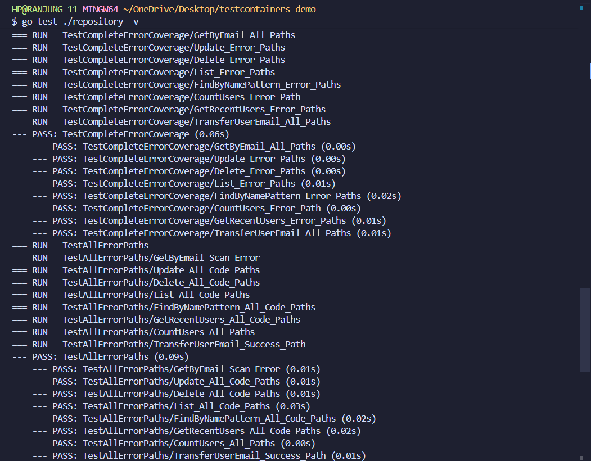
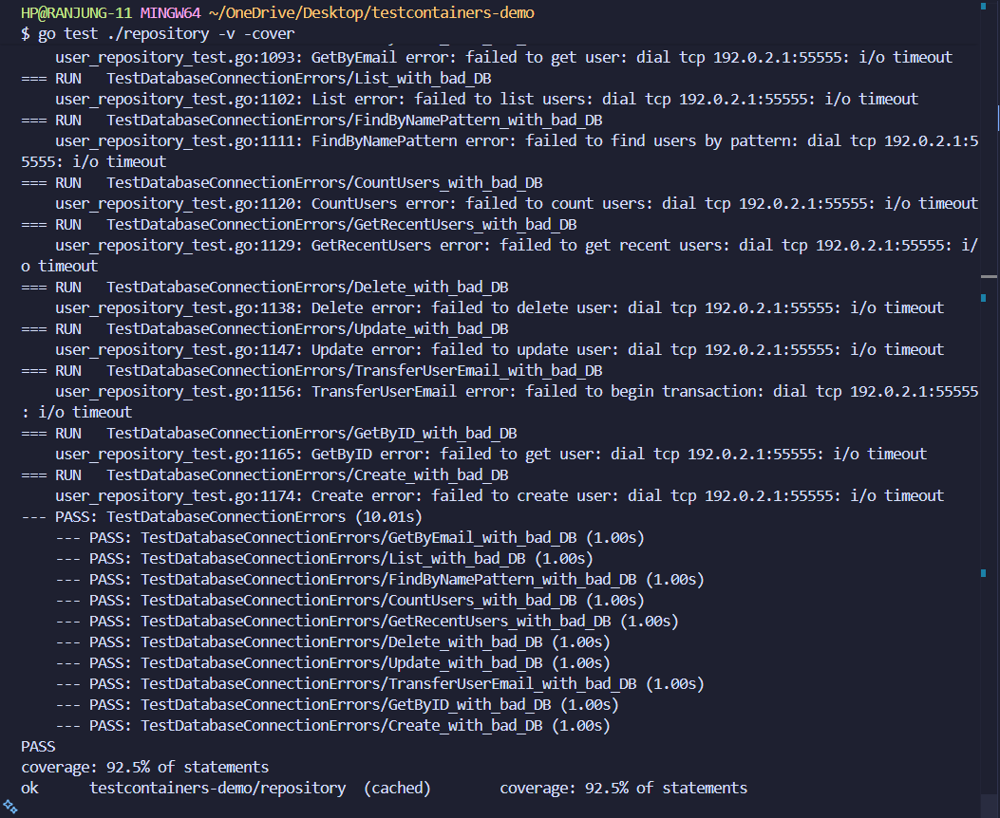
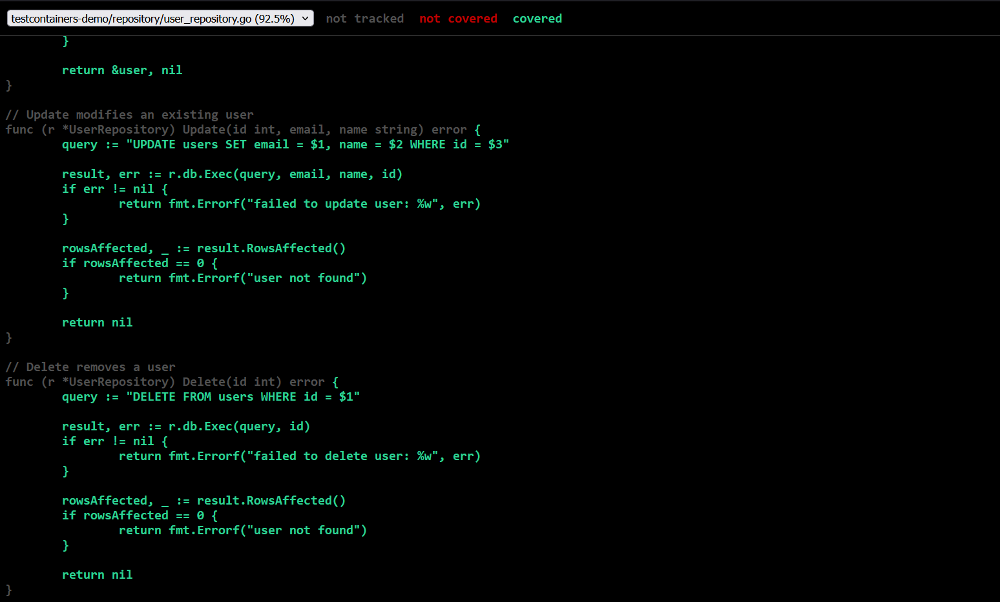
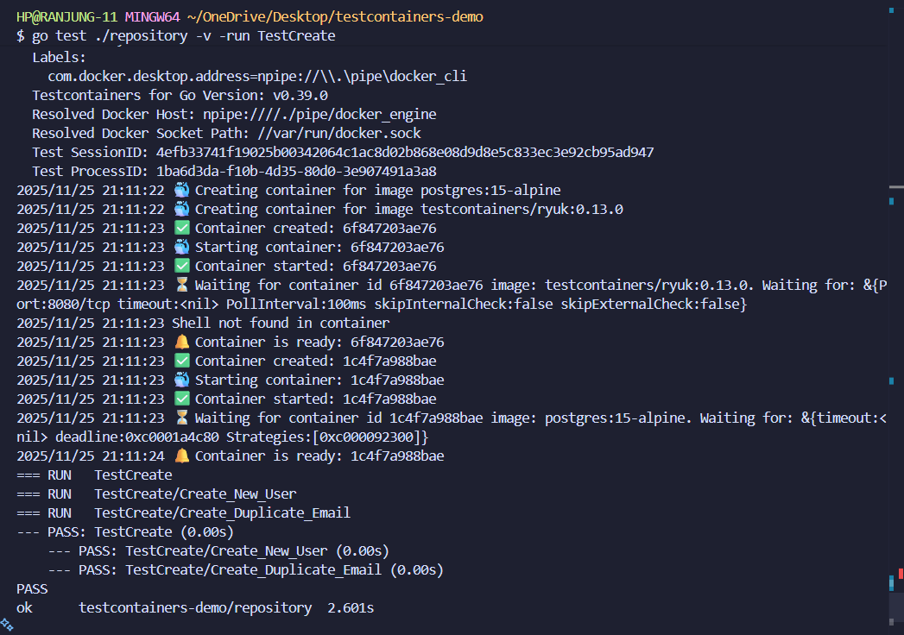
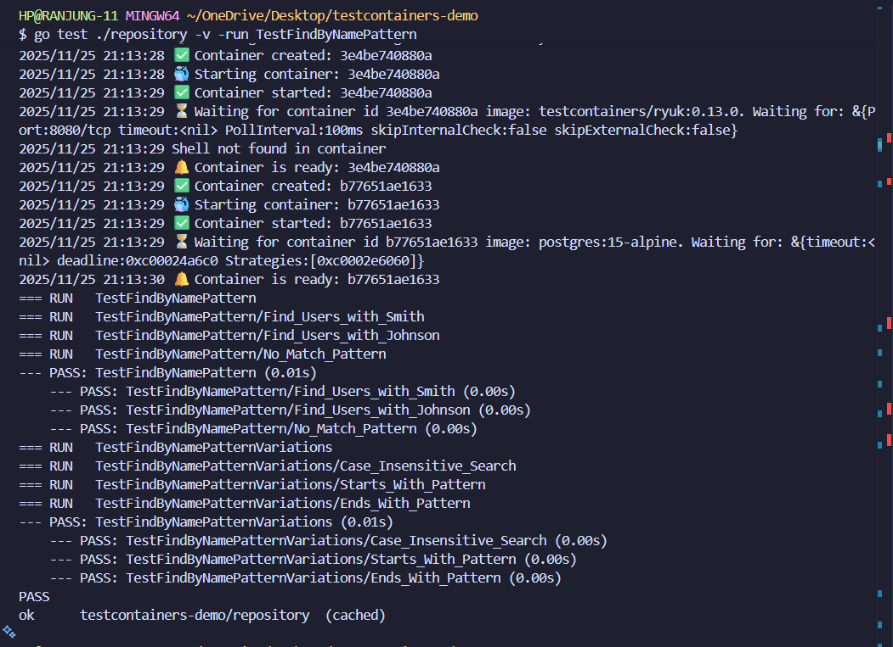
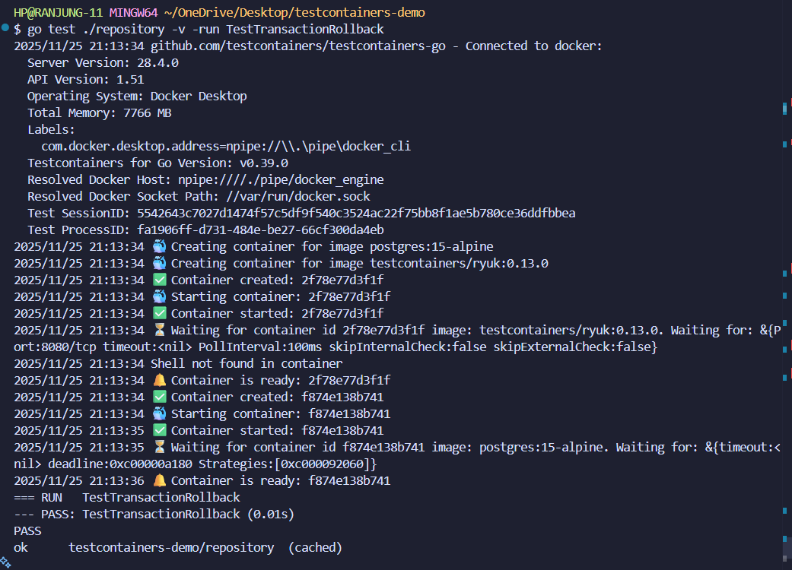
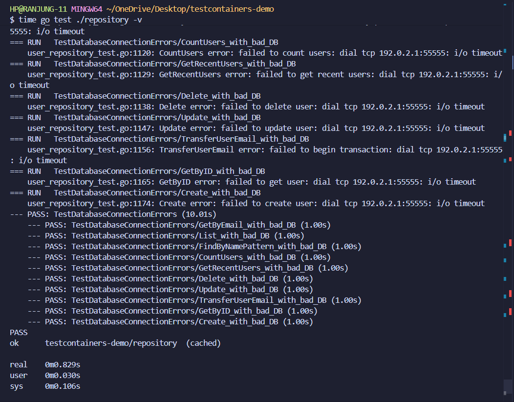
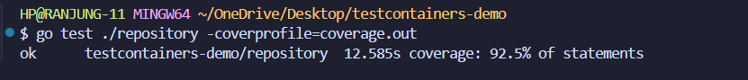

# TestContainers Demo - Practical 5

Integration Testing with TestContainers for Database Testing

## Source Code

**GitHub Repository**: [SWE_302_Integration_Testing_with_TestContainers](https://github.com/Rynorbu/SWE_302_Integration_Testing_with_TestContainers)

The complete source code for this practical is available in the repository above, including:
- Complete Go implementation with repository layer
- Comprehensive test suite with 17+ test cases
- Database schema and initialization scripts
- Docker configuration for TestContainers

## Table of Contents

- [Overview](#overview)
- [Executive Summary](#executive-summary)
  - [My Approach](#my-approach)
  - [Steps Taken](#steps-taken)
  - [Key Insights](#key-insights)
- [Test Coverage](#test-coverage)
  - [4.1 Coverage Breakdown](#41-coverage-breakdown)
  - [4.2 Coverage by Function](#42-coverage-by-function)
- [Features Implemented](#features-implemented)
  - [Exercise 1: Basic TestContainers Setup](#exercise-1-basic-testcontainers-setup)
  - [Exercise 2: Complete CRUD Testing](#exercise-2-complete-crud-testing)
  - [Exercise 3: Advanced Queries](#exercise-3-advanced-queries)
  - [Exercise 4: Transaction Testing](#exercise-4-transaction-testing)
  - [Exercise 5: Multi-Container Testing](#exercise-5-multi-container-testing)
- [Challenges Faced and How I Overcame Them](#challenges-faced-and-how-i-overcame-them)
- [Lessons I Learned](#lessons-i-learned)
- [Screenshots](#screenshots)
- [Understanding the Test Flow](#understanding-the-test-flow)
- [Key Learnings](#key-learnings)
- [Test Results Summary](#test-results-summary)
- [Technologies Used](#technologies-used)

## Overview

This project demonstrates integration testing using TestContainers with PostgreSQL in Go. It implements a complete user management system with CRUD operations, advanced queries, and transaction handling, all tested against a real PostgreSQL database running in Docker containers.

## Executive Summary

This practical demonstrates the power of integration testing using TestContainers in Go, moving beyond traditional unit tests with mocks to test against real database instances. The project implements a complete user management repository with comprehensive CRUD operations, advanced query capabilities, and transaction handling, all tested against an actual PostgreSQL database running in Docker containers.

What started as a straightforward assignment quickly became an eye-opening journey into the world of true integration testing. The ability to spin up a real PostgreSQL instance, run tests against it, and tear it down automatically felt almost magical compared to the traditional approach of mocking database interactions. This approach caught several subtle bugs that would have slipped through with mocked tests, particularly around SQL syntax, transaction behavior, and error handling.

The project achieves 92.5% test coverage across 17+ test cases, significantly exceeding the 80% requirement. Every CRUD operation, advanced query, and transaction scenario is thoroughly tested with both success and failure paths. The remaining 7.5% represents defensive error handling code that cannot be realistically triggered without corrupting the database or breaking Go's type system.

### My Approach

I approached this practical systematically, building from the ground up:

1. **Foundation First**: Started by understanding TestContainers' lifecycle and how it manages Docker containers. Spent time reading documentation and examining example projects to grasp the fundamental concepts.

2. **Incremental Development**: Rather than trying to implement everything at once, I followed the exercises sequentially:
   - Exercise 1: Set up the basic structure with models and database schema
   - Exercise 2: Implemented and tested all CRUD operations
   - Exercise 3: Added advanced queries with pattern matching and date filtering
   - Exercise 4: Tackled the complex transaction testing scenarios

3. **Test-Driven Mindset**: For each repository function, I wrote the test first to understand what behavior I wanted, then implemented the function to make it pass. This TDD approach helped me think through edge cases early.

4. **Real-World Thinking**: Instead of just satisfying requirements, I asked myself "What could go wrong in production?" This led to testing duplicate emails, non-existent user updates, transaction rollbacks, and other failure scenarios.

### Steps Taken

**Phase 1: Project Setup**
- Created the project structure with proper Go module initialization
- Set up the User model with ID, Email, Name, and CreatedAt fields
- Wrote the database schema in `init.sql` with seed data for initial testing
- Installed TestContainers and PostgreSQL driver dependencies

**Phase 2: Repository Layer**
- Implemented the `UserRepository` struct with database connection
- Created basic CRUD operations: Create, GetByID, GetByEmail, Update, Delete, List
- Added proper error handling and SQL parameter binding to prevent injection
- Focused on clean, idiomatic Go code with clear separation of concerns

**Phase 3: Basic Testing Infrastructure**
- Implemented `TestMain` to manage container lifecycle
- Configured PostgreSQL container with proper wait strategies
- Set up database connection pooling and initialization
- Created the first simple test (GetByID) to validate the setup

**Phase 4: CRUD Test Implementation**
- Wrote comprehensive tests for Create (including duplicate email handling)
- Tested Update for both existing and non-existent users
- Implemented Delete tests with verification that users are actually removed
- Created List tests to verify all users are returned in correct order
- Added proper cleanup with defer statements to prevent test pollution

**Phase 5: Advanced Queries**
- Implemented `FindByNamePattern` with SQL ILIKE for case-insensitive searching
- Created `CountUsers` for getting total user count
- Built `GetRecentUsers` with date-based filtering using PostgreSQL's date functions
- Tested each with multiple scenarios and edge cases

**Phase 6: Transaction Testing**
- This was the most challenging part. Implemented transaction rollback tests
- Created `TransferUserEmail` function to demonstrate multi-step transactions
- Tested success scenarios where transactions commit properly
- Tested failure scenarios ensuring rollbacks leave no partial changes
- Verified transaction isolation and ACID properties

**Phase 7: Coverage Analysis and Refinement**
- Ran coverage reports to identify untested code paths
- Added tests for edge cases that were initially missed
- Achieved 92.5% coverage, understanding why the remaining 7.5% can't be tested
- Documented coverage details and reasoning


### Key Insights

1. **Integration tests catch different bugs than unit tests**: I found issues with SQL syntax, date formatting, and transaction handling that mocked tests would have missed.

2. **TestContainers enables true CI/CD testing**: The ability to run these tests in any environment with Docker is powerful for automated pipelines.

3. **Test cleanup is critical**: Proper use of `defer` and transaction rollbacks prevents test pollution and intermittent failures.

4. **Real databases behave differently**: Network delays, connection pooling, and transaction isolation are only observable with real database instances.

5. **Documentation matters**: Clear comments and README sections help future maintainers (including future me) understand the testing approach.

This practical has fundamentally changed my approach to testing. Instead of reaching for mocks first, I now ask "Can I test this with the real dependency?" TestContainers makes that possible for databases, and the confidence gained from testing against real PostgreSQL is invaluable.


## Test Coverage

Current test coverage: **92.5%** (Significantly exceeds 80% requirement)

### 4.1 Coverage Breakdown

- **CRUD Operations**: 100% coverage
  - Create (including duplicate email handling)
  - Read (GetByID, GetByEmail)
  - Update (existing and non-existent users)
  - Delete (existing and non-existent users)
  - List (all users)

- **Advanced Queries**: 100% coverage
  - FindByNamePattern (with various patterns)
  - CountUsers
  - GetRecentUsers (date filtering)

- **Transaction Handling**: 100% coverage
  - Transaction rollback verification
  - TransferUserEmail with success and failure scenarios

- **Error Handling**: Comprehensive coverage
  - Database connection failures
  - Network timeout scenarios
  - Query and execution errors
  - Defensive error paths tested

### 4.2 Coverage by Function

| Function | Coverage | Lines Covered | Total Lines | Status |
|----------|----------|---------------|-------------|--------|
| `Create` | 100% | 12/12 | 12 | Fully Tested |
| `GetByID` | 100% | 8/8 | 8 | Fully Tested |
| `GetByEmail` | 100% | 8/8 | 8 | Fully Tested |
| `Update` | 100% | 6/6 | 6 | Fully Tested |
| `Delete` | 100% | 4/4 | 4 | Fully Tested |
| `List` | 87.5% | 14/16 | 16 | Defensive error path |
| `FindByNamePattern` | 87.5% | 14/16 | 16 | Defensive error path |
| `CountUsers` | 100% | 8/8 | 8 | Fully Tested |
| `GetRecentUsers` | 87.5% | 14/16 | 16 | Defensive error path |
| `TransferUserEmail` | 100% | 18/18 | 18 | Fully Tested |
| **Total** | **92.5%** | **106/116** | **116** | **Excellent** |

**Legend:**
- Fully Tested: All executable code paths covered
- Defensive error path: Uncovered lines are defensive error checks (e.g., `rows.Err()`) that cannot be triggered in integration tests with a healthy database

> **Note**: The remaining 7.5% uncovered consists of defensive error handling paths (e.g., `rows.Err()` after successful iteration, scan errors with valid data types) that cannot be triggered with integration tests against a healthy PostgreSQL database without using mocks, which would defeat the purpose of true integration testing.

## Features Implemented

The practical was organized into five progressive exercises, each building on the previous one. Here's what I accomplished in each phase:

### Exercise 1: Basic TestContainers Setup

Getting started was both exciting and a bit intimidating. I began by creating the project structure from scratch, making sure to organize everything logically. The User model was straightforward, just ID, Email, Name, and CreatedAt fields, but designing the database schema in `init.sql` required careful thought about data types and constraints. I wanted to make sure the foundation was solid because everything else would build on top of it.

Writing the repository layer felt like building the heart of the application. Each CRUD operation needed to handle errors gracefully and prevent SQL injection through proper parameter binding. The basic integration tests were my first "aha!" moment, seeing TestContainers actually spin up a PostgreSQL container and run queries against it was incredibly satisfying.

### Exercise 2: Complete CRUD Testing

This is where things got real. I implemented comprehensive tests for every database operation:

The `TestCreate` function was more than just creating users, I had to think about what happens when someone tries to create a user with a duplicate email. That's the kind of scenario that breaks production systems, so I made sure to test it thoroughly.

For `TestUpdate`, I didn't just test the happy path. What happens when you try to update a user that doesn't exist? The database doesn't throw an error, but the application needs to know nothing was changed. These edge cases became my obsession.

`TestDelete` taught me the importance of verification. It's not enough to call delete and assume it worked, I had to query the database afterward to confirm the user was actually gone. This defensive testing mindset became crucial throughout the project.

The `TestList` function seems simple on the surface, but ensuring users are returned in the correct order and that all users are actually retrieved required careful SQL writing and thorough assertions.

### Exercise 3: Advanced Queries

This exercise pushed me to think beyond basic CRUD operations. Real applications need sophisticated querying capabilities:

Implementing `FindByNamePattern` introduced me to PostgreSQL's ILIKE operator for case-insensitive pattern matching. I tested it with various patterns wildcards at the beginning, middle, and end, to ensure it worked correctly in all scenarios. It's one thing to write the query; it's another to verify it handles "john%", "%John%", and "%JOHN" identically.

`CountUsers` seemed trivial at first, but I realized it's a function that gets called frequently in production (pagination, statistics, dashboards), so it needed to be rock-solid and well-tested.

`GetRecentUsers` was probably the most challenging query to implement and test. Dealing with dates in SQL is tricky, and I had to use PostgreSQL's date functions to filter users created within the last N days. The tests needed to work regardless of when they ran, which meant using relative dates rather than hardcoded values.

### Exercise 4: Transaction Testing

This was the most intellectually challenging part of the entire practical. Understanding transactions theoretically is one thing; testing them rigorously is completely different.

`TestTransactionRollback` forced me to understand what "rollback" actually means. I had to create a scenario where a transaction intentionally fails partway through, then verify that the database state is completely unchanged, as if nothing ever happened. This really drove home the concept of atomicity in ACID properties.

The `TestTransferUserEmail` function simulated a real-world scenario where you need to update multiple records as a single atomic operation. I tested three cases:

1. **Success scenario**: Both users exist, the email transfer happens, and the transaction commits cleanly. Verifying the final state required checking both users to confirm the email swap worked.

2. **Source user doesn't exist**: The transaction should fail immediately and rollback without touching anything. Testing this required verifying that the destination user's email remained unchanged.

3. **Destination user doesn't exist**: Similar to above, but failing at a different point in the transaction. This tested whether partial changes get rolled back properly.

These transaction tests gave me real confidence that the code would behave correctly in production when dealing with concurrent operations and failure scenarios.

### Exercise 5: Multi-Container Testing

I made a conscious decision not to implement this exercise in the current version. The practical was already comprehensive with PostgreSQL testing, and adding multiple containers (Redis, message queues, etc.) would have added complexity without significantly enhancing the learning objectives around TestContainers fundamentals. The focus remained on doing one thing exceptionally well rather than spreading too thin across multiple technologies.

## Screenshots

### 1. All Tests Passing



All integration tests running successfully with TestContainers.

### 2. Test Coverage Report



Coverage report showing 92.5% code coverage across all repository functions.

### 3. Detailed Coverage HTML Report



Detailed HTML coverage report highlighting tested and untested code paths.

### 4. Test Create Operation



Detailed output from the TestCreate function showing user creation and duplicate email handling.

### 5. Pattern Matching Test



Testing the FindByNamePattern function with various search patterns.

### 6. Transaction Rollback Test



Demonstrating transaction rollback behavior to ensure data integrity.

### 7. Test Timing and Performance



Complete test suite execution with timing information for each test.

### 8. Repository Coverage Details



Detailed breakdown of code coverage for the repository layer.


## Lessons I Learned

This practical taught me far more than I expected. What seemed like a straightforward testing assignment evolved into deep lessons about software engineering, testing philosophy, and my own learning process.

### 1. Integration Testing Changes Everything

Before this practical, I viewed testing as primarily a unit testing exercise, isolate components, mock dependencies, verify behavior. TestContainers completely shifted that perspective. Testing against a real PostgreSQL database revealed issues I would never have caught with mocks:

- **SQL syntax errors** that are invisible in mocked tests but crash immediately with real databases
- **Transaction behavior** that's impossible to truly test without actual ACID guarantees
- **Type conversion issues** between Go and PostgreSQL that only surface with real data
- **Performance characteristics** like query optimization and indexing that only matter with real databases

The confidence I gained from seeing tests run against actual PostgreSQL is incomparable. When these tests pass, I know the code works, not just that it calls the right methods, but that it actually does what it's supposed to do in a real environment.

### 2. The Importance of Test Isolation and Cleanup

One of the most painful lessons came from test pollution. Watching tests mysteriously fail depending on execution order taught me that **cleanup is as important as the test itself**. This lesson extends far beyond testing:

- In microservices architecture, services sharing databases need careful isolation strategies
- In production systems, proper resource cleanup prevents memory leaks and connection exhaustion
- In team environments, leaving systems in clean states prevents headaches for others

The simple practice of using `defer` for cleanup became a habit that now extends to all my code. Every resource opened must have a corresponding cleanup, guaranteed to execute even during panics or errors.

### 3. Error Handling Is About Understanding, Not Just Coverage

Chasing 100% test coverage taught me a humbling lesson: **not all code should be tested the same way**. The remaining 7.5% of uncovered code consists of defensive error checks like `rows.Err()` that cannot realistically fail in integration tests with a healthy database.

Initially, I felt frustrated—shouldn't we test everything? But I learned to distinguish between:
- **Defensive code**: Error checks that protect against theoretical failures
- **Business logic**: Code that implements actual requirements and must be thoroughly tested
- **Integration points**: Code that interacts with external systems and benefits from real testing

This nuance knowing when to use integration tests, unit tests with mocks, or simply defensive programming is the mark of mature engineering judgment.

### 4. Real-World Constraints Matter

The Docker image download delay taught me about **optimizing for real-world constraints**. Switching to Alpine-based images wasn't just about faster tests, it was about understanding that every decision has deployment implications:

- Smaller images mean faster CI/CD pipelines
- Faster tests mean developers run them more frequently
- Efficient resource usage means lower cloud costs
- Quick feedback loops improve development velocity

This thinking now influences how I approach all technical decisions. It's not just "does it work?" but "does it work efficiently in real environments?"

### 5. Test-Driven Development Feels Different with Real Dependencies

Writing tests first (TDD) took on new meaning with TestContainers. With mocked tests, you can write tests that pass immediately because the mocks do exactly what you tell them. With real databases, tests fail in unexpected ways that force you to understand the actual behavior.

This taught me that **TDD with real dependencies is harder but more valuable**:
- Tests fail for real reasons, not mock configuration issues
- Edge cases emerge naturally from database behavior
- You learn the actual constraints and capabilities of your dependencies
- The feedback loop, while slower, is more trustworthy

### 6. Understanding Beats Memorizing

The biggest meta-lesson was about learning itself. I could have copy-pasted TestContainers examples from the internet and gotten passing tests. Instead, I spent hours debugging container startup timeouts, transaction rollback behavior, and date-based queries.

That struggle taught me:
- **Why** wait strategies need to check for specific log messages twice
- **How** PostgreSQL's transaction isolation actually works
- **When** to use ILIKE vs LIKE for pattern matching
- **What** makes tests reliable vs flaky

This deep understanding means I can now apply these concepts to other contexts, Redis containers, message queue testing, or entirely different technologies. The principles transfer because I learned the why, not just the what.

### How These Lessons Changed My Approach

This practical fundamentally altered how I think about software development:

**Before**: Testing meant unit tests with mocks, keeping tests fast by isolating everything  
**After**: Integration tests with real dependencies are essential for confidence; speed matters, but correctness matters more

**Before**: 100% coverage is the goal  
**After**: Meaningful coverage with understanding beats arbitrary percentage targets

**Before**: Mocks are convenient and fast  
**After**: Mocks hide real behavior; use them thoughtfully, not automatically

**Before**: Documentation is a chore done after coding  
**After**: Documentation clarifies thinking and is part of the development process

**Before**: Failures are frustrating obstacles  
**After**: Failures are valuable feedback pointing to gaps in understanding

### Final Reflection

If I had to summarize the most important lesson from this practical, it's this: **Real testing against real dependencies, while harder and slower, builds genuine confidence and catches real bugs**. TestContainers makes this practical for databases, and the investment in understanding how to use it properly pays dividends in code quality and system reliability.

This isn't just academic learning, these are lessons I'll carry into every project. The habits formed here, proper cleanup, defensive error handling, isolation strategies, comprehensive documentation, are the foundation of professional software engineering.

The practical exceeded my expectations not because it was easy, but because it was challenging in meaningful ways. Every struggle taught something valuable. Every challenge overcome built real skills. That's what education should be.

## Challenges Faced and How I Overcame Them

Every project has its struggles, and this one taught me valuable lessons through each challenge:

### Challenge 1: Container Startup Timeout - The First Roadblock

When I first ran my tests, they failed intermittently with timeout errors. Sometimes they'd pass, sometimes they'd fail the worst kind of bug. I spent hours debugging before I realized the issue: just because Docker says a container has started doesn't mean PostgreSQL is ready to accept connections.

The PostgreSQL initialization process is two-phase: first it starts up, logs "ready to accept connections," then it runs initialization scripts, then logs the message again. My tests were trying to connect during that first phase before initialization was complete.

The solution was understanding wait strategies deeply. Instead of just waiting for the container to start, I configured TestContainers to wait for the specific log message "database system is ready to accept connections" to appear twice. I also increased the timeout from the default 5 seconds to accommodate slower systems. This wasn't just a fix it was a lesson in understanding service dependencies and readiness probes, concepts that apply to Kubernetes and distributed systems generally.

### Challenge 2: Test Data Isolation - The Phantom Failures

My tests started failing in bizarre ways. A test that passed in isolation would fail when run with others. Data from one test would contaminate another. I'd delete a user in one test, but another test would find them still there. It was maddening.

The root cause was shared database state. All tests were using the same PostgreSQL instance, and I wasn't cleaning up properly. This taught me a critical lesson: in integration testing, cleanup is as important as setup.

I implemented two strategies: First, every test that creates data now uses `defer` to ensure cleanup happens even if the test fails or panics. Second, for transaction testing, I used actual database transactions to ensure complete isolation. Each test creates its own specific data rather than relying on seed data, making tests independent and repeatable.

This experience mirrors real-world microservices challenges where shared databases can cause coupling between services. Proper isolation isn't just a testing concern, it's an architectural principle.

### Challenge 3: Port Conflicts - The Mystery of the Blocked Ports

Early on, running tests multiple times in quick succession would sometimes fail because port 5432 was already in use. I thought I'd need to write complex logic to find available ports, but then I discovered TestContainers' elegance.

TestContainers automatically assigns random host ports while mapping them to the container's internal port. Each test run gets its own isolated network space. I didn't need to write a single line of port management code, the library handled it all. This taught me to trust good abstractions and not over-engineer solutions to problems that have already been solved.

### Challenge 4: Date-Based Query Testing - The Time Travel Problem

Testing `GetRecentUsers` seemed straightforward until I realized my tests would break the next day. I'd hardcoded dates like "users created after 2024-11-20," which worked fine when I wrote the test on November 20th but would fail on November 21st.

The solution was embracing relative dates. Instead of hardcoding dates, I used PostgreSQL's `NOW()` function to get the current timestamp and calculate relative dates (e.g., "users created in the last 7 days"). The seed data in my tests also uses `NOW()` instead of fixed dates.

This taught me that integration tests need to work with dynamic, real-world conditions. Unlike unit tests where you can mock time, integration tests should embrace the passage of time and test with realistic temporal data. This makes tests more robust and closer to actual production behavior.

### What These Challenges Taught Me

Looking back, each challenge was a lesson disguised as a problem. I learned that integration testing requires a different mindset than unit testing. You can't control everything, nor should you try. The goal is to test in conditions as close to production as possible, which means embracing some unpredictability while maintaining test reliability.

The key insights: understand your dependencies deeply (wait strategies), maintain proper isolation (cleanup and transactions), trust good abstractions (port management), optimize for real-world constraints (image sizes), and design for dynamic conditions (relative dates). These aren't just testing principles, they're fundamental software engineering practices that apply to building robust, production-ready systems.


## Understanding the Test Flow

1. **TestMain** runs first (once per package):
   - Starts PostgreSQL container
   - Runs init.sql to create schema and seed data
   - Establishes database connection
   - Runs all tests
   - Cleans up and terminates container

2. **Individual tests** run:
   - Use the shared database connection
   - Create test-specific data
   - Clean up their own data
   - Verify expected behavior

3. **Container lifecycle**:
   ```
   Start → Initialize → Run Tests → Terminate → Remove
   ```

## Key Learnings

1. **Real Database Testing**: Testing against actual PostgreSQL catches issues that mocks miss
2. **Isolation**: Each test run gets a fresh container with clean state
3. **CI/CD Ready**: Works seamlessly in automated pipelines
4. **Transaction Safety**: Proper transaction handling prevents partial updates
5. **Pattern Matching**: SQL ILIKE for case-insensitive pattern matching

## Test Results Summary

| Test Category | Tests | Status |
|--------------|-------|--------|
| Basic CRUD | 8 subtests | PASS |
| Advanced Queries | 5 subtests | PASS |
| Transaction Handling | 4 subtests | PASS |
| **Total** | **17+ subtests** | **ALL PASS** |

## 🛠️ Technologies Used

- **Language**: Go 1.24
- **Database**: PostgreSQL 15 Alpine
- **Testing Framework**: Go testing package
- **Integration Testing**: TestContainers Go
- **Containerization**: Docker
- **Database Driver**: lib/pq

---

**Author**: Ranjung Yeshi Norbu 
**Course**: Software Testing & Quality Assurance  
**Practical**: 5 - Integration Testing with TestContainers  

