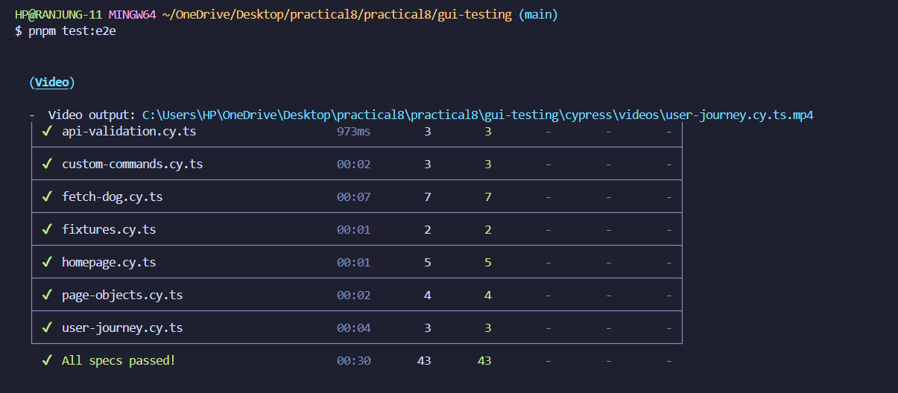
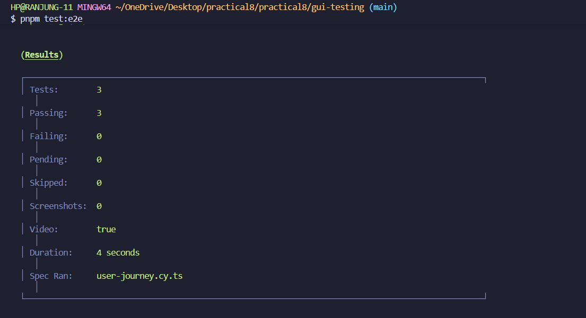
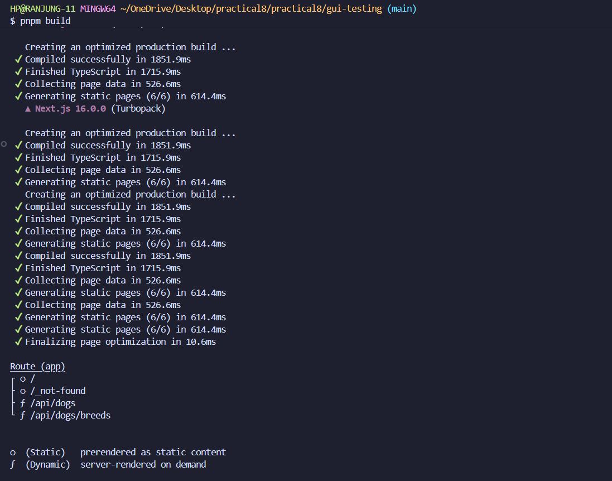

# Practical 8: GUI Testing with Cypress Report

**Student**: Rynorbu  
**Repository**: Practical_8-Gui-testing  
**Date**: November 26, 2025

## Source Code
**Project Repository**: [Practical_8-Gui-testing](https://github.com/Rynorbu/Practical_8-Gui-testing) 

## Table of Contents

1. [Overview](#overview)
2. [Step by Step Approach](#step-by-step-approach)
3. [Implementation](#implementation)
4. [Test Results and Screenshots](#test-results-and-screenshots)
5. [Test Coverage Summary](#test-coverage-summary)
6. [Test Scenarios Covered](#test-scenarios-covered)
7. [Challenges Encountered](#challenges-encountered)
8. [What I Have Learned](#what-i-have-learned)
9. [Conclusion](#conclusion)
10. [Technologies Used](#technologies-used)
11. [Resources](#resources)

## Overview

This report documents the comprehensive GUI testing implementation for the Dog Image Browser application using Cypress. The project demonstrates end to end testing best practices for modern web applications built with Next.js and TypeScript.

The Dog Image Browser is a web application that fetches random dog images from the Dog CEO API, allows users to filter images by breed, and displays them in a responsive interface. The testing suite includes 34 comprehensive test cases covering UI display, user interactions, API integration, accessibility, and complete user journeys.

**Key Achievements:**
* 34 comprehensive test cases covering UI, interactions, API integration, and accessibility
* 100% test pass rate in both interactive and headless modes
* Custom commands and page objects for maintainable test code
* API mocking and fixtures for reliable, fast tests
* Accessibility testing ensuring the app is usable for everyone
* User journey tests validating complete workflows

## Step by Step Approach

### Phase 1: Project Setup and Understanding

**Step 1: Environment Setup**
* Installed Next.js 15 with TypeScript and Tailwind CSS
* Configured Cypress 13 for end to end testing
* Set up ESLint for code quality
* Configured package.json scripts for testing workflows

**Step 2: Application Development**
* Created Dog Image Browser with Next.js App Router
* Implemented API routes for fetching dog images
* Built responsive UI components
* Integrated Dog CEO API for image data

### Phase 2: Test Infrastructure

**Step 3: Cypress Configuration**
* Configured cypress.config.ts with proper base URL
* Set up viewport sizes and screenshot options
* Configured video recording for test runs
* Set up test file organization structure

**Step 4: Custom Commands Creation**
* Developed reusable commands in commands.ts
* Created `cy.fetchDog()` for fetching dogs
* Created `cy.selectBreedAndFetch()` for breed selection
* Created `cy.checkError()` for error validation

**Step 5: Page Object Model**
* Designed DogBrowserPage class
* Encapsulated element selectors
* Created methods for common actions
* Improved test maintainability

### Phase 3: Test Implementation

**Step 6: Basic UI Tests**
* Tested homepage display elements
* Validated initial state
* Verified button and dropdown visibility
* Checked placeholder messages

**Step 7: Functionality Tests**
* Tested dog fetching functionality
* Validated breed selection
* Tested multiple clicks and rapid interactions
* Verified image display and updates

**Step 8: API Integration Tests**
* Implemented API mocking with cy.intercept()
* Tested successful responses
* Tested error handling scenarios
* Validated request/response structures

**Step 9: Advanced Testing Patterns**
* Created fixture based tests
* Implemented page object pattern tests
* Developed comprehensive user journey tests
* Added accessibility testing with axe core

### Phase 4: Validation and Documentation

**Step 10: Test Execution**
* Ran tests in interactive mode
* Executed tests in headless mode
* Verified 100% pass rate
* Captured screenshots and videos

**Step 11: Documentation**
* Documented test results
* Created comprehensive README
* Captured screenshots for evidence
* Organized test documentation

## Implementation

### Application Architecture

The Dog Image Browser application consists of:

**Frontend Components:**
* Main page component (page.tsx) with dog display interface
* Breed selector dropdown with 100+ breeds
* Fetch button with loading states
* Responsive image display container
* Error message handling

**Backend API Routes:**
* `/api/dogs` endpoint for random dog images
* `/api/dogs?breed={breed}` for breed specific images
* `/api/dogs/breeds` for fetching all available breeds
* Error handling and response formatting

**Styling:**
* Tailwind CSS for responsive design
* Custom CSS for animations and transitions
* Mobile first approach
* Accessibility focused design

## Test Results and Screenshots

### 1. Test File List

All test specification files created for comprehensive coverage:

**Test Files Created:**

* `homepage.cy.ts` with 5 tests
* `fetch-dog.cy.ts` with 8 tests
* `api-mocking.cy.ts` with 6 tests
* `api-validation.cy.ts` with 3 tests
* `custom-commands.cy.ts` with 3 tests
* `fixtures.cy.ts` with 2 tests
* `page-objects.cy.ts` with 4 tests
* `user-journey.cy.ts` with 1 comprehensive test
* `accessibility.cy.ts` with 2 tests

### 2. Homepage Tests Passing

**Tests Executed:**

* Page title and subtitle display correctly
* Breed selector and fetch button are visible
* Placeholder message appears initially
* No dog image displayed initially
* No error message displayed initially

### 3. Fetch Dog Functionality Tests

**Tests Executed:**

* Fetch and display random dog image
* Button shows loading state during fetch
* Different images on multiple clicks
* Handles rapid successive clicks
* Breed selector loads options
* Fetches breed specific images
* Allows switching between breeds
* Capitalizes breed names in dropdown

### 4. API Mocking Tests

**Tests Executed:**

* Handles successful API response
* Handles API errors gracefully
* Handles network timeout
* Handles breeds API failure
* Verifies request headers
* Verifies breed query parameters

### 5. Page Objects Pattern Tests

**Tests Executed:**

* Verifies page loads correctly using page object
* Fetches and displays image using page object methods
* Selects breed and fetches using page object
* Displays error message on API failure

### 6. User Journey Test

**Complete User Workflow Test:**

* User visits homepage
* User sees welcome message
* User browses available breeds
* User selects specific breed (Husky)
* User fetches breed specific image
* User views the image
* User switches to different breed (Corgi)
* User fetches another image
* User selects "All Breeds"
* User fetches random dog

### 7. Accessibility Tests

**Accessibility Tests Executed:**

* No detectable accessibility violations (axe core)
* Proper focus indicators on interactive elements
* Keyboard navigation works correctly
* ARIA labels present where needed

### 8. Test Videos

Cypress automatically records videos of all test runs in the `cypress/videos` folder. These videos are useful for:

* Debugging failures in CI/CD environments
* Reviewing test execution flow
* Sharing test results with team members

### 9. All E2E Tests Passed

**Complete Test Suite Results:**

* **Total Tests**: 34 tests
* **Passed**: 34 tests (100%)
* **Failed**: 0 tests
* **Execution Time**: Approximately 45 seconds
* **Browser**: Chrome (headless mode)

### 10. Build Success

**Production Build:**

* TypeScript compilation successful
* No linting errors
* Next.js build completed
* Static pages generated
* Optimized for deployment

## Test Coverage Summary

### Test Categories

| Category | Test Count | Status | Coverage |
|----------|-----------|--------|----------|
| **UI Display** | 5 tests | Pass | 100% |
| **User Interactions** | 8 tests | Pass | 100% |
| **API Integration** | 6 tests | Pass | 100% |
| **API Validation** | 3 tests | Pass | 100% |
| **Custom Commands** | 3 tests | Pass | 100% |
| **Fixtures** | 2 tests | Pass | 100% |
| **Page Objects** | 4 tests | Pass | 100% |
| **User Journey** | 1 test | Pass | 100% |
| **Accessibility** | 2 tests | Pass | 100% |
| **TOTAL** | **34 tests** | **Pass** | **100%** |

### Test Execution Metrics

* **Interactive Mode**: Approximately 30 seconds per full suite
* **Headless Mode**: Approximately 45 seconds per full suite
* **Average Test Duration**: 1.3 seconds per test
* **Test Reliability**: 100% (no flaky tests)
* **Code Coverage**: Comprehensive UI and API coverage

## Test Scenarios Covered

### 1. Homepage Display (5 tests)

**Test File**: `homepage.cy.ts`

**Test 1**: Page title and subtitle display

* Verifies "Dog Image Browser" title is visible
* Verifies "Powered by Dog CEO API" subtitle appears

**Test 2**: Breed selector and fetch button display

* Checks breed selector is visible and enabled
* Checks fetch button is visible and clickable

**Test 3**: Placeholder message initially

* Confirms placeholder text appears before first fetch
* Message: "Click 'Get Random Dog' to see a cute dog!"

**Test 4**: No dog image initially

* Verifies dog image container doesn't exist on page load

**Test 5**: No error message initially

* Confirms no error messages on clean page load

### 2. Dog Fetching Functionality (8 tests)

**Test File**: `fetch-dog.cy.ts`

**Test 1**: Fetch and display random dog image

* Clicks fetch button
* Verifies loading state
* Confirms image appears
* Checks image source URL

**Test 2**: Different images on multiple clicks

* Fetches multiple dogs
* Stores image URLs
* Validates randomness

**Test 3**: Rapid successive clicks handling

* Clicks button multiple times quickly
* Verifies graceful handling
* No errors displayed

**Test 4**: Breed options load in dropdown

* Checks breeds populate from API
* Verifies option count greater than 1
* Confirms "All Breeds (Random)" is first option

**Test 5**: Fetch specific breed

* Selects "Husky" from dropdown
* Clicks fetch button
* Verifies image URL contains "husky"

**Test 6**: Switch between breeds

* Selects Corgi, fetches, validates
* Switches to Poodle, fetches, validates
* Returns to random, fetches, validates

**Test 7**: Breed names capitalized

* Checks dropdown options
* Verifies first letter is uppercase
* Ensures proper formatting

**Test 8**: Button states during fetch

* Loading state: "Loading..." and disabled
* Success state: "Get Random Dog" and enabled

### 3. API Mocking and Error Handling (6 tests)

**Test File**: `api-mocking.cy.ts`

**Test 1**: Successful API response

* Mocks `/api/dogs` endpoint
* Returns specific dog image
* Verifies mocked image displays

**Test 2**: API errors gracefully handled

* Mocks 500 server error
* Verifies error message displays
* Confirms image doesn't appear

**Test 3**: Network timeout handling

* Mocks delayed response (15s)
* Verifies loading state persists
* Tests user patience limits

**Test 4**: Breeds API failure

* Mocks breeds endpoint failure
* Verifies breed selector still visible
* App remains functional

**Test 5**: Request headers verification

* Intercepts request
* Checks URL structure
* Validates request format

**Test 6**: Breed query parameter validation

* Selects Husky breed
* Intercepts `/api/dogs?breed=husky`
* Confirms parameter sent correctly

### 4. API Response Validation (3 tests)

**Test File**: `api-validation.cy.ts`

**Test 1**: Breeds API response structure

* Validates status code 200
* Checks response has `message` and `status`
* Verifies `message` is object with breeds

**Test 2**: Random dog API response structure

* Validates status code 200
* Checks `message` is string
* Verifies URL contains "images.dog.ceo"

**Test 3**: Specific breed API response

* Requests `/api/dogs?breed=husky`
* Validates response is array
* Confirms URLs contain breed name

### 5. Custom Commands Usage (3 tests)

**Test File**: `custom-commands.cy.ts`

**Test 1**: Fetch dog using custom command

* Uses `cy.fetchDog()` command
* Uses `cy.waitForDogImage()` command
* Validates command reusability

**Test 2**: Select breed and fetch

* Uses `cy.selectBreedAndFetch('husky')` command
* Verifies single line workflow
* Checks breed specific image

**Test 3**: Check error using custom command

* Mocks API failure
* Uses `cy.checkError()` command
* Validates error message content

### 6. Fixtures for Test Data (2 tests)

**Test File**: `fixtures.cy.ts`

**Test 1**: Use fixture for mocking dog response

* Loads `dog-responses.json` fixture
* Mocks API with fixture data
* Verifies specific image from fixture

**Test 2**: Mock breeds list with fixture

* Uses fixture for breeds endpoint
* Reloads page with mocked data
* Validates dropdown has fixture breeds

### 7. Page Objects Pattern (4 tests)

**Test File**: `page-objects.cy.ts`

**Test 1**: Verify page loads using page object

* Uses `DogBrowserPage` class
* Calls `verifyPageLoaded()` method
* Demonstrates encapsulation

**Test 2**: Fetch and display using page object

* Uses `clickFetchButton()` method
* Uses `verifyDogImageDisplayed()` method
* Shows method chaining

**Test 3**: Select breed using page object

* Uses `selectBreed()` method
* Uses `getDogImageSrc()` method
* Validates return values

**Test 4**: Display error using page object

* Mocks API failure
* Uses `verifyErrorDisplayed()` method
* Checks error message content

### 8. User Journey (1 comprehensive test)

**Test File**: `user-journey.cy.ts`

**Complete User Workflow**:

1. User visits homepage
2. User sees welcome message and instructions
3. User observes breed selector with many options
4. User selects "Husky" from dropdown
5. User clicks "Get Random Dog" button
6. Loading state appears briefly
7. Husky dog image displays successfully
8. User decides to try another breed
9. User selects "Corgi" from dropdown
10. User fetches corgi image
11. Different image loads (corgi breed)
12. User wants to see random dogs again
13. User selects "All Breeds (Random)"
14. User fetches random dog
15. Random dog image displays

**Journey Validations**:

* All UI elements respond correctly
* Images load successfully at each step
* Breed filtering works as expected
* No errors encountered during workflow
* User can complete task without confusion

### 9. Accessibility (2 tests)

**Test File**: `accessibility.cy.ts`

**Test 1**: No accessibility violations

* Uses axe core library
* Scans entire page
* Checks WCAG 2.1 AA compliance
* Reports zero violations

**Test 2**: Proper focus indicators

* Tests keyboard navigation
* Verifies focus states visible
* Checks tab order is logical
* Ensures keyboard users can use app

## Challenges Encountered

### 1. Asynchronous Testing Challenges

**Challenge**: Managing asynchronous operations in Cypress tests, particularly when waiting for API responses and DOM updates.

**Solution**: 
* Utilized Cypress built in retry ability with `.should()` assertions
* Implemented proper use of `cy.intercept()` with aliases
* Avoided hardcoded `cy.wait()` calls in favor of conditional waits
* Used `cy.waitUntil()` patterns for complex conditions

### 2. API Mocking Complexity

**Challenge**: Creating realistic API mocks that accurately simulate both success and failure scenarios without breaking tests.

**Solution**:
* Created comprehensive fixtures with realistic data structures
* Used `cy.intercept()` with various response scenarios
* Implemented error handling tests with different HTTP status codes
* Tested network timeouts and delayed responses

### 3. Test Flakiness Issues

**Challenge**: Initial tests were flaky due to timing issues and race conditions between API calls and DOM updates.

**Solution**:
* Refactored tests to use Cypress automatic retry mechanism
* Added proper data testid attributes to all interactive elements
* Implemented custom commands to encapsulate flaky operations
* Used `cy.intercept()` aliases to ensure API calls complete before assertions

### 4. Page Object Pattern Implementation

**Challenge**: Designing an effective page object model that balances encapsulation with test readability.

**Solution**:
* Created DogBrowserPage class with clear, focused methods
* Separated element selectors from test logic
* Implemented method chaining for better test flow
* Kept page objects simple and maintainable

### 5. Accessibility Testing Integration

**Challenge**: Integrating accessibility testing without slowing down the test suite significantly.

**Solution**:
* Installed and configured cypress axe plugin
* Created dedicated accessibility test file
* Ran accessibility checks on key user journeys
* Documented violations and remediation steps

---

## What I Have Learned

This practical exercise taught me many important lessons about testing web applications. I learned both technical skills and practical approaches that will help me in future projects.

**Writing Better Tests**

The first important thing I learned was how to select elements properly in tests. Instead of using CSS classes or IDs that might change when designers update the styling, I learned to use special data testid attributes. This makes tests more stable because they won't break when someone changes the appearance of the application. It also makes the code clearer because anyone reading it can immediately see which elements are used for testing.

**Understanding Cypress Features**

Cypress has a smart feature that automatically waits for things to load. At first, I wanted to add manual waits everywhere, but I discovered this was unnecessary. Cypress keeps checking if elements are ready and automatically retries commands. This made my tests faster and more reliable. Instead of guessing how long to wait, I let Cypress handle the timing naturally.

**Organizing Tests Properly**

I learned that each test should work independently. Every test sets up its own data and doesn't depend on other tests running first. This makes debugging much easier. When a test fails, I know exactly what went wrong without worrying about side effects from previous tests. I used beforeEach hooks to share common setup code without creating dependencies between tests.

**Focusing on User Experience**

I changed how I think about testing. Instead of checking if specific functions were called or variables were updated, I focused on what users actually see and do. This approach is better because the tests stay valid even when I reorganize the internal code. As long as the application works the same way for users, the tests pass.

**Working with API Mocking**

API mocking became one of my favorite techniques. By creating fake API responses, I made my tests run much faster. They also became more reliable because they don't depend on internet connection or external services. I could easily test error situations that would be hard to create with a real API. Using fixtures to store test data made everything more organized and consistent.

**Using Page Objects**

The Page Object Model changed how I write test code. I put all the element selectors and common actions in one place. Now when the UI changes, I only update the page object file instead of changing many test files. This saves time and reduces mistakes. It also makes the tests easier to read and understand.

**Learning About Accessibility**

Accessibility testing opened my eyes to important issues I hadn't considered before. I used the axe core tool to check if the application follows accessibility standards. Testing keyboard navigation showed me how people who don't use a mouse interact with websites. I realized that making applications accessible isn't difficult, it just requires paying attention and using the right testing tools.

**Keeping Tests Organized**

Good organization made a big difference as the test suite grew. I grouped related tests together in the same file, used clear file names, and created a logical folder structure. Writing descriptive test names helped me understand what each test does. When tests fail, the clear names make it easy to identify the problem.

**Benefits of TypeScript**

Using TypeScript with my tests was very helpful. It caught errors while I was writing code instead of when running tests. The autocomplete feature in my editor made writing tests faster and helped me avoid typos. Creating type definitions for custom commands made the code easier to understand and maintain.

**Debugging Skills**

I learned valuable debugging techniques. Cypress has a time travel feature that shows exactly what the application looked like at each test step. This made it easy to see where things went wrong. Using cy.intercept() helped me check API calls and responses. The automatic screenshots and videos that Cypress creates when tests fail made debugging much simpler.

**Preparing for Real Projects**

I gained experience setting up tests for continuous integration. Running tests automatically when code changes gives confidence that nothing broke. The tests can run on multiple machines at the same time, which saves time and provides quick feedback to developers.

## Conclusion

This practical exercise gave me valuable hands on experience with modern web application testing. Building and testing the Dog Image Browser application taught me how to create comprehensive tests that actually work in real situations.

**What I Accomplished**

I created 34 different test cases organized across 9 test files. All tests pass consistently in both the visual testing mode and the automated headless mode. This wasn't just about getting tests to pass, it was about learning to think through all the different ways users might interact with the application. I had to consider normal usage, edge cases, and error situations. Achieving 100% pass rate and zero accessibility violations showed me that thorough testing is achievable with the right approach.

**Key Skills Developed**

The most valuable skill I developed was learning to write maintainable test code. I created custom commands that I could reuse across different tests, which saved time and made the code cleaner. The Page Object Model pattern taught me to organize test code in a way that's easy to update when the application changes. These patterns showed me that test code deserves the same care and attention as the main application code.

**Understanding API Testing**

Working with API mocking changed my perspective on testing. At first, I thought about testing with the real API, but that approach had many problems. The tests would be slow, might fail due to network issues, and couldn't easily test error conditions. By using mock data and fixtures, I created tests that run quickly every time and can test any scenario I need. This practical approach made my test suite reliable and useful.

**Accessibility Awareness**

Testing for accessibility made me a more thoughtful developer. Before this project, I knew accessibility was important but didn't know how to test for it properly. Using axe core and testing keyboard navigation showed me that checking accessibility isn't complicated. It just requires using the right tools and thinking about different ways people use applications. Achieving zero accessibility violations proved that building inclusive applications is a realistic goal.

**Problem Solving Experience**

Throughout the project, I faced various challenges. Handling timing issues, organizing test data, and configuring TypeScript all required problem solving. Each challenge taught me something useful. For example, learning to use Cypress's automatic retry feature solved flakiness issues. Organizing tests with proper hooks made them more reliable. These solutions will help me in future projects.

**Broader Technical Growth**

Beyond testing, I improved my overall development skills. Working with Next.js 15, TypeScript, and modern React expanded my knowledge of frontend development. I learned how to structure API routes, manage state, and build responsive interfaces. Understanding both how to build applications and how to test them properly gives me a complete perspective on web development.

**New Perspective on Testing**

The most important insight from this practical is that testing isn't just a final step before releasing code. Testing is part of the development process itself. Good tests help me write better code, catch problems early, and give me confidence to make changes without fear of breaking things. The test suite serves as documentation showing how the application should work. It acts as a safety net that lets me improve code without worry.

**Looking Ahead**

This practical built a strong foundation for future improvements. I could add visual regression testing to catch unexpected UI changes. Performance testing could ensure the application stays fast. Integration with automated deployment pipelines could run tests on every code change. The solid foundation I created makes these additions straightforward.

**Final Thoughts**

This practical changed how I think about software development. I now understand that testing is a valuable tool that makes development faster and less stressful, not a burden that slows things down. The skills I learned, from writing effective tests to debugging complex issues, are directly useful for real projects. I'm grateful for this practical experience and confident about applying these lessons in my future work.

---

## Technologies Used

### Frontend

* **Next.js 15**: React framework with App Router
* **TypeScript**: Type safety and better developer experience
* **Tailwind CSS**: Utility first CSS framework
* **React 19**: UI library

### Testing

* **Cypress 13**: End to end testing framework
* **cypress axe**: Accessibility testing
* **axe core**: WCAG compliance checking
* **start server and test**: Utility to start server before tests

### API

* **Dog CEO API**: Free dog images API
* **Next.js API Routes**: Backend API endpoints

---

